# GomsBook AI Agent LLM Design

**Version:** 1.0.0  
**Status:** Draft  
**Last Updated:** 2026-08-03

---

# 1. Overview

## 1.1 Purpose

This document defines the Large Language Model (LLM) Framework used by GomsBook AI Agent.

The framework provides a provider-independent abstraction layer for interacting with cloud-based and local Large Language Models while ensuring consistent request handling, structured responses, security, and extensibility.

Unlike directly calling a specific LLM API, the framework isolates provider-specific implementations behind common interfaces, allowing GomsBook AI Agent to support multiple providers without changing business logic.

---

## 1.2 Objectives

The LLM Framework has the following objectives.

- Provider-independent architecture
- Unified request model
- Unified response model
- Support Tool Calling
- Support Structured Output
- Support Streaming
- Support Local LLM
- Support Cloud LLM
- Provider failover
- Cost monitoring
- Token monitoring
- Secure API management
- Future MCP compatibility

---

## 1.3 Scope

The framework is responsible for

- Provider abstraction
- Request execution
- Response mapping
- Streaming
- Retry
- Model configuration
- Token usage
- Cost estimation
- Security policy
- Provider routing

The framework is NOT responsible for

- Prompt construction
- EPUB generation
- XHTML validation
- File modification
- Tool execution
- RAG retrieval

These responsibilities belong to other frameworks.

---

# 2. Design Principles

The LLM Framework follows the following architectural principles.

---

## 2.1 Provider Independence

Business logic must never depend on

- OpenAI
- Gemini
- Claude
- Ollama
- LM Studio

Only the LLM Provider layer knows how to communicate with each provider.

---

## 2.2 Single Responsibility

The framework separates

- Request generation
- Provider communication
- Response parsing
- Retry
- Monitoring
- Security

into independent components.

---

## 2.3 Immutable Models

Every request and response should be immutable.

Java Records are recommended.

---

## 2.4 Structured Responses

The framework should prefer structured outputs.

Supported formats

- JSON
- JSON Schema
- XHTML
- XML
- Markdown

---

## 2.5 Streaming First

Every provider should support

- synchronous response
- streaming response

through the same interface whenever possible.

---

## 2.6 Provider Extensibility

Adding a new provider should require only

- one Provider implementation
- one configuration

No business logic should change.

---

# 3. LLM Framework Architecture

The framework separates prompt construction from provider execution.

```text
Prompt Framework
        │
        ▼
PromptRequest
        │
        ▼
LlmClient
        │
        ▼
Provider Selector
        │
        ▼
LlmProvider
        │
        ├──────────────┐
        ▼              ▼
    OpenAI        Gemini
        │              │
        ▼              ▼
     Claude        Ollama
        │
        ▼
    LM Studio
        │
        ▼
LlmResponse
        │
        ▼
Prompt Framework
```

---

## 3.1 Layer Responsibilities

| Layer | Responsibility |
|--------|----------------|
| Prompt Framework | Prompt generation |
| LlmClient | Execute request |
| Provider Selector | Select provider |
| LlmProvider | Provider abstraction |
| Provider Adapter | API communication |
| Response Mapper | Convert provider response |
| Monitoring | Metrics |
| Retry | Recovery |

---

# 4. Architecture Diagram

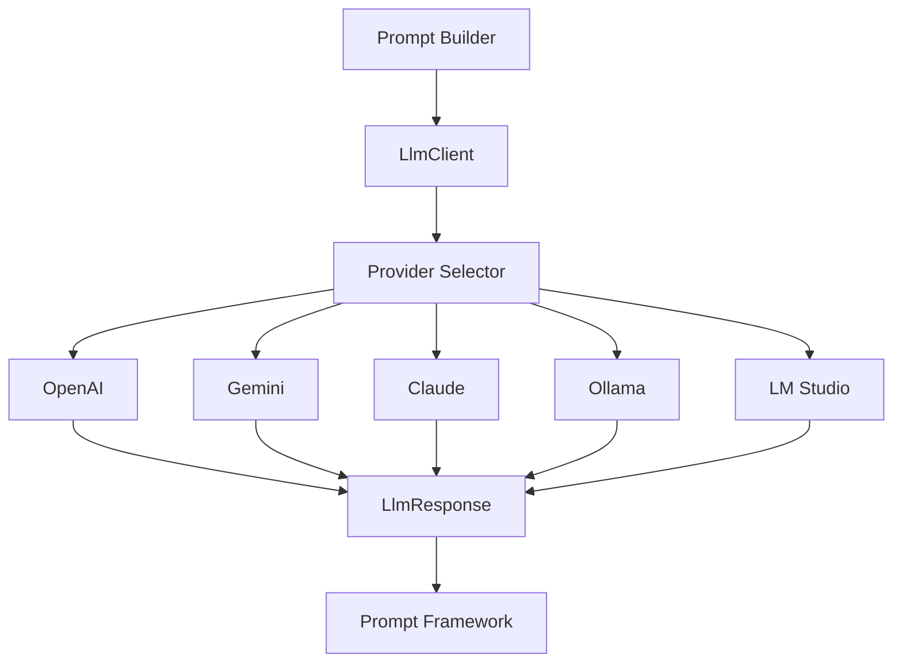

---

# 5. Core Components

The framework consists of the following components.

| Component | Responsibility |
|------------|----------------|
| LlmClient | Execute requests |
| LlmProvider | Provider interface |
| ProviderSelector | Select provider |
| RequestMapper | Provider mapping |
| ResponseMapper | Normalize responses |
| StreamingClient | Streaming support |
| RetryCoordinator | Retry execution |
| TokenCounter | Token estimation |
| CostMonitor | Cost calculation |
| SecurityManager | Provider policy |

---

# 6. Request Flow

The execution flow is identical regardless of provider.

```text
PromptRequest

↓

LlmClient

↓

Provider Selector

↓

Selected Provider

↓

Provider API

↓

Provider Response

↓

Response Mapping

↓

LlmResponse
```

---

## 6.1 Execution Sequence

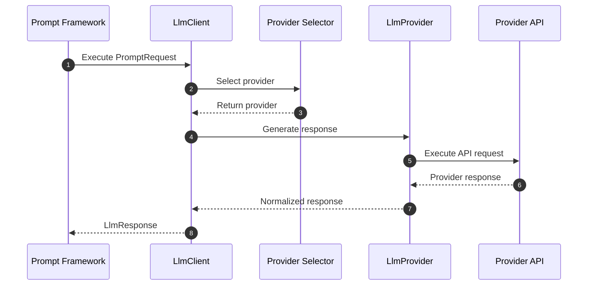

---

# 7. Request Lifecycle

Every request follows the same lifecycle.

```text
PromptRequest

↓

Provider Selection

↓

Security Check

↓

Request Mapping

↓

Provider Execution

↓

Response Mapping

↓

Token Usage

↓

Cost Recording

↓

Return Response
```

---

# 8. Provider Responsibilities

Every provider implementation must

- validate configuration
- build API request
- execute request
- parse response
- normalize output
- report token usage
- report finish reason
- support timeout
- support cancellation
- support retry

---

# 9. Framework Principles

The LLM Framework follows these principles.

### Provider Neutral

Business logic never depends on provider APIs.

---

### Request Normalization

All providers receive a common request model.

---

### Response Normalization

All responses are converted into a common response model.

---

### Extensibility

Providers can be added without changing existing code.

---

### Testability

Every provider can be mocked.

---

### Reliability

Provider failures are isolated.

---

### Security

API keys never leave the provider layer.

---

### Monitoring

Every request is measurable.

---

### Scalability

The framework supports

- Cloud LLM
- Local LLM
- Future MCP Gateway

without architectural changes.

---

# Summary

The LLM Framework acts as the execution layer between the Prompt Framework and external AI providers.

Rather than exposing provider-specific APIs throughout the application, the framework introduces a unified execution model centered around `LlmClient`, `LlmProvider`, and a normalized request/response abstraction.

This design enables GomsBook AI Agent to support multiple cloud and local LLM providers while maintaining portability, security, observability, and future extensibility.

# 10. Core LLM Interfaces

The LLM Framework defines a small set of common interfaces and immutable models.

The core abstraction is designed around the following relationship:

```text
PromptRequest
      │
      ▼
LlmClient
      │
      ▼
LlmProvider
      │
      ▼
Provider API
      │
      ▼
LlmResponse
```

The Prompt Framework creates the request.

The LLM Framework executes the request.

The Provider implementation handles provider-specific communication.

---

# 11. LlmClient

`LlmClient` is the primary entry point for synchronous LLM execution.

Business logic should depend on `LlmClient`, not on a provider-specific implementation.

```java
package kr.co.goms.gomsbook.ai.llm.client;

import kr.co.goms.gomsbook.ai.llm.model.LlmRequest;
import kr.co.goms.gomsbook.ai.llm.model.LlmResponse;

public interface LlmClient {

    LlmResponse generate(LlmRequest request);

}
```

---

## 11.1 Responsibilities

`LlmClient` is responsible for:

- Validating the request
- Selecting a provider
- Applying security policy
- Executing the provider request
- Coordinating retries
- Mapping provider errors
- Recording usage and metrics
- Returning a normalized response

---

## 11.2 DefaultLlmClient

```java
package kr.co.goms.gomsbook.ai.llm.client;

import java.util.Objects;

import kr.co.goms.gomsbook.ai.llm.model.LlmRequest;
import kr.co.goms.gomsbook.ai.llm.model.LlmResponse;
import kr.co.goms.gomsbook.ai.llm.provider.LlmProvider;
import kr.co.goms.gomsbook.ai.llm.routing.ProviderSelector;

public final class DefaultLlmClient implements LlmClient {

    private final ProviderSelector providerSelector;

    public DefaultLlmClient(
            ProviderSelector providerSelector
    ) {
        this.providerSelector = Objects.requireNonNull(
                providerSelector,
                "providerSelector must not be null."
        );
    }

    @Override
    public LlmResponse generate(LlmRequest request) {
        Objects.requireNonNull(
                request,
                "request must not be null."
        );

        LlmProvider provider =
                providerSelector.select(request);

        return provider.generate(request);
    }
}
```

The initial implementation may be simple.

Retry, security, monitoring, and fallback can be introduced through decorators or execution coordinators later.

---

# 12. StreamingLlmClient

Streaming execution should be exposed through a separate interface.

```java
package kr.co.goms.gomsbook.ai.llm.client;

import java.util.concurrent.Flow.Publisher;

import kr.co.goms.gomsbook.ai.llm.model.LlmRequest;
import kr.co.goms.gomsbook.ai.llm.streaming.LlmStreamEvent;

public interface StreamingLlmClient {

    Publisher<LlmStreamEvent> stream(LlmRequest request);

}
```

---

## 12.1 Why Separate Streaming

Synchronous and streaming execution have different operational characteristics.

Streaming requires:

- Incremental response handling
- Cancellation
- Backpressure
- Partial output processing
- Stream completion events
- Stream failure recovery

Separating the interfaces prevents the synchronous API from becoming unnecessarily complex.

---

# 13. LlmProvider

`LlmProvider` defines the common contract implemented by every cloud and local provider.

```java
package kr.co.goms.gomsbook.ai.llm.provider;

import kr.co.goms.gomsbook.ai.llm.model.LlmRequest;
import kr.co.goms.gomsbook.ai.llm.model.LlmResponse;

public interface LlmProvider {

    LlmProviderType getType();

    String getName();

    boolean isAvailable();

    ProviderCapabilities getCapabilities();

    LlmResponse generate(LlmRequest request);

}
```

---

## 13.1 Provider Responsibilities

Every provider implementation must:

- Validate provider configuration
- Verify model availability
- Map the common request to the provider format
- Execute the provider API call
- Map the provider response to `LlmResponse`
- Normalize finish reasons
- Report usage information
- Convert provider errors into common exceptions
- Respect timeout and cancellation policies
- Avoid exposing provider SDK types outside the provider package

---

# 14. LlmProviderType

```java
package kr.co.goms.gomsbook.ai.llm.provider;

public enum LlmProviderType {
    OPENAI,
    GEMINI,
    CLAUDE,
    OLLAMA,
    LM_STUDIO,
    MOCK
}
```

`MOCK` is used for tests and offline evaluation.

---

# 15. ProviderCapabilities

Providers and models do not all support the same features.

Capabilities must therefore be explicitly described.

```java
package kr.co.goms.gomsbook.ai.llm.provider;

public record ProviderCapabilities(
        boolean systemMessages,
        boolean developerMessages,
        boolean structuredOutput,
        boolean jsonSchema,
        boolean toolCalling,
        boolean streaming,
        boolean vision,
        boolean embeddings,
        boolean localExecution
) {
}
```

---

## 15.1 Example Capabilities

```java
ProviderCapabilities ollamaCapabilities =
        new ProviderCapabilities(
                true,
                false,
                true,
                false,
                false,
                true,
                false,
                true,
                true
        );
```

Capability values may also depend on the selected model.

Therefore, the final implementation may define capabilities at both provider and model level.

---

# 16. LlmRequest

`LlmRequest` is the normalized request model used by all providers.

```java
package kr.co.goms.gomsbook.ai.llm.model;

import java.time.Duration;
import java.util.List;
import java.util.Map;

import kr.co.goms.gomsbook.ai.llm.config.ModelConfiguration;
import kr.co.goms.gomsbook.ai.llm.tool.LlmToolDefinition;

public record LlmRequest(
        String requestId,
        ModelConfiguration model,
        List<LlmMessage> messages,
        LlmResponseFormat responseFormat,
        List<LlmToolDefinition> tools,
        LlmGenerationOptions options,
        Duration timeout,
        Map<String, Object> metadata
) {

    public LlmRequest {
        messages = messages == null
                ? List.of()
                : List.copyOf(messages);

        tools = tools == null
                ? List.of()
                : List.copyOf(tools);

        metadata = metadata == null
                ? Map.of()
                : Map.copyOf(metadata);

        timeout = timeout == null
                ? Duration.ofSeconds(60)
                : timeout;
    }
}
```

---

## 16.1 Request Validation

A valid request must satisfy:

- `requestId` is present
- A model is configured
- At least one message exists
- Message contents are valid
- Requested tools are compatible with the provider
- The output format is supported
- Timeout is positive
- Token limits are within model limits
- Sensitive data policy has been evaluated

---

# 17. LlmMessage

```java
package kr.co.goms.gomsbook.ai.llm.model;

import java.util.List;
import java.util.Map;

public record LlmMessage(
        LlmRole role,
        List<LlmContentPart> content,
        String name,
        String toolCallId,
        Map<String, Object> metadata
) {

    public LlmMessage {
        content = content == null
                ? List.of()
                : List.copyOf(content);

        metadata = metadata == null
                ? Map.of()
                : Map.copyOf(metadata);
    }

    public static LlmMessage text(
            LlmRole role,
            String text
    ) {
        return new LlmMessage(
                role,
                List.of(new LlmTextContent(text)),
                null,
                null,
                Map.of()
        );
    }
}
```

Using a list of content parts allows future support for:

- Text
- Images
- Documents
- Tool results
- Audio
- Binary references

---

# 18. LlmRole

```java
package kr.co.goms.gomsbook.ai.llm.model;

public enum LlmRole {
    SYSTEM,
    DEVELOPER,
    USER,
    ASSISTANT,
    TOOL
}
```

Provider adapters are responsible for mapping unsupported roles.

For example, a provider that does not support `DEVELOPER` may merge it into the system instruction according to provider policy.

---

# 19. LlmContentPart

```java
package kr.co.goms.gomsbook.ai.llm.model;

public sealed interface LlmContentPart
        permits LlmTextContent,
                LlmImageContent,
                LlmToolResultContent {
}
```

---

## 19.1 Text Content

```java
package kr.co.goms.gomsbook.ai.llm.model;

public record LlmTextContent(
        String text
) implements LlmContentPart {

    public LlmTextContent {
        if (text == null) {
            throw new IllegalArgumentException(
                    "text must not be null."
            );
        }
    }
}
```

---

## 19.2 Image Content

```java
package kr.co.goms.gomsbook.ai.llm.model;

public record LlmImageContent(
        String source,
        String mediaType,
        LlmImageDetail detail
) implements LlmContentPart {
}
```

```java
package kr.co.goms.gomsbook.ai.llm.model;

public enum LlmImageDetail {
    AUTO,
    LOW,
    HIGH
}
```

The `source` may represent:

- A local resource reference
- A temporary signed URL
- A provider file identifier
- A base64 value, when explicitly supported

Raw image bytes should not be stored inside general logs.

---

## 19.3 Tool Result Content

```java
package kr.co.goms.gomsbook.ai.llm.model;

public record LlmToolResultContent(
        String toolCallId,
        String toolName,
        String result,
        boolean error
) implements LlmContentPart {
}
```

---

# 20. ModelConfiguration

`ModelConfiguration` identifies the selected provider, model, and generation limits.

```java
package kr.co.goms.gomsbook.ai.llm.config;

import java.util.Map;

import kr.co.goms.gomsbook.ai.llm.provider.LlmProviderType;

public record ModelConfiguration(
        LlmProviderType provider,
        String modelName,
        int contextWindow,
        int maxOutputTokens,
        boolean streamingEnabled,
        Map<String, Object> providerOptions
) {

    public ModelConfiguration {
        if (provider == null) {
            throw new IllegalArgumentException(
                    "provider must not be null."
            );
        }

        if (modelName == null || modelName.isBlank()) {
            throw new IllegalArgumentException(
                    "modelName must not be blank."
            );
        }

        if (contextWindow <= 0) {
            throw new IllegalArgumentException(
                    "contextWindow must be positive."
            );
        }

        if (maxOutputTokens <= 0) {
            throw new IllegalArgumentException(
                    "maxOutputTokens must be positive."
            );
        }

        providerOptions = providerOptions == null
                ? Map.of()
                : Map.copyOf(providerOptions);
    }
}
```

---

# 21. LlmGenerationOptions

Generation options are normalized across providers.

```java
package kr.co.goms.gomsbook.ai.llm.model;

import java.util.List;
import java.util.Map;

public record LlmGenerationOptions(
        Double temperature,
        Double topP,
        Integer topK,
        Long seed,
        List<String> stopSequences,
        Map<String, Object> providerOptions
) {

    public LlmGenerationOptions {
        stopSequences = stopSequences == null
                ? List.of()
                : List.copyOf(stopSequences);

        providerOptions = providerOptions == null
                ? Map.of()
                : Map.copyOf(providerOptions);
    }

    public static LlmGenerationOptions deterministic() {
        return new LlmGenerationOptions(
                0.0,
                null,
                null,
                null,
                List.of(),
                Map.of()
        );
    }
}
```

---

## 21.1 Option Mapping

Provider adapters decide how normalized options map to provider APIs.

Examples:

```text
temperature
→ Supported by most providers

topP
→ Supported by most providers

topK
→ Provider-dependent

seed
→ Model-dependent

stopSequences
→ Syntax differs by provider
```

Unsupported optional values may be ignored only when the behavior is documented.

Required values must cause a capability error if unsupported.

---

# 22. LlmResponseFormat

```java
package kr.co.goms.gomsbook.ai.llm.model;

public record LlmResponseFormat(
        LlmResponseFormatType type,
        String schemaId,
        String schemaVersion,
        String schema
) {

    public static LlmResponseFormat text() {
        return new LlmResponseFormat(
                LlmResponseFormatType.TEXT,
                null,
                null,
                null
        );
    }

    public static LlmResponseFormat json() {
        return new LlmResponseFormat(
                LlmResponseFormatType.JSON,
                null,
                null,
                null
        );
    }
}
```

```java
package kr.co.goms.gomsbook.ai.llm.model;

public enum LlmResponseFormatType {
    TEXT,
    JSON,
    JSON_SCHEMA,
    XHTML,
    XML,
    MARKDOWN
}
```

---

## 22.1 Provider Mapping

The common format is mapped by the provider adapter.

```text
JSON_SCHEMA
    │
    ├── Native provider schema mode
    ├── JSON mode with schema instructions
    └── Prompt-only schema fallback
```

Fallback behavior must be explicit.

The framework must not claim native schema enforcement when only prompt instructions are being used.

---

# 23. LlmResponse

```java
package kr.co.goms.gomsbook.ai.llm.model;

import java.time.Duration;
import java.util.List;
import java.util.Map;

import kr.co.goms.gomsbook.ai.llm.provider.LlmProviderType;
import kr.co.goms.gomsbook.ai.llm.tool.LlmToolCall;

public record LlmResponse(
        String requestId,
        String responseId,
        LlmProviderType provider,
        String modelName,
        List<LlmMessage> messages,
        List<LlmToolCall> toolCalls,
        LlmUsage usage,
        LlmFinishReason finishReason,
        Duration duration,
        Map<String, Object> metadata
) {

    public LlmResponse {
        messages = messages == null
                ? List.of()
                : List.copyOf(messages);

        toolCalls = toolCalls == null
                ? List.of()
                : List.copyOf(toolCalls);

        metadata = metadata == null
                ? Map.of()
                : Map.copyOf(metadata);
    }

    public String firstText() {
        return messages.stream()
                .flatMap(message -> message.content().stream())
                .filter(LlmTextContent.class::isInstance)
                .map(LlmTextContent.class::cast)
                .map(LlmTextContent::text)
                .findFirst()
                .orElse("");
    }
}
```

---

# 24. LlmUsage

```java
package kr.co.goms.gomsbook.ai.llm.model;

public record LlmUsage(
        int inputTokens,
        int outputTokens,
        int totalTokens,
        Integer cachedInputTokens,
        Integer reasoningTokens
) {

    public LlmUsage {
        if (inputTokens < 0
                || outputTokens < 0
                || totalTokens < 0) {
            throw new IllegalArgumentException(
                    "Token counts cannot be negative."
            );
        }
    }

    public static LlmUsage unknown() {
        return new LlmUsage(
                0,
                0,
                0,
                null,
                null
        );
    }
}
```

Some local providers may not return accurate usage data.

In that case, the framework should mark the usage as estimated or unknown rather than fabricating exact values.

---

# 25. LlmFinishReason

```java
package kr.co.goms.gomsbook.ai.llm.model;

public enum LlmFinishReason {
    STOP,
    LENGTH,
    TOOL_CALL,
    CONTENT_FILTER,
    CANCELLED,
    ERROR,
    UNKNOWN
}
```

Provider-specific finish values must be normalized into this enum.

The original provider value may be retained in response metadata.

---

# 26. LLM Tool Definitions

The LLM Framework uses provider-neutral Tool definitions.

```java
package kr.co.goms.gomsbook.ai.llm.tool;

public record LlmToolDefinition(
        String name,
        String description,
        String inputSchema,
        boolean strict
) {
}
```

---

## 26.1 LLM Tool Call

```java
package kr.co.goms.gomsbook.ai.llm.tool;

public record LlmToolCall(
        String id,
        String name,
        String argumentsJson
) {
}
```

The LLM Framework only returns the normalized Tool Call.

It does not execute the Tool.

Execution remains the responsibility of the Agent and Tool Framework.

---

# 27. Provider Selector

The Provider Selector chooses a provider for each request.

```java
package kr.co.goms.gomsbook.ai.llm.routing;

import kr.co.goms.gomsbook.ai.llm.model.LlmRequest;
import kr.co.goms.gomsbook.ai.llm.provider.LlmProvider;

public interface ProviderSelector {

    LlmProvider select(LlmRequest request);

}
```

---

## 27.1 Selection Factors

Provider selection may consider:

- Explicit provider selection
- Model configuration
- Local-only project policy
- Required Tool Calling support
- Required JSON Schema support
- Required vision support
- Context window size
- Provider availability
- Cost policy
- Latency policy
- Data sensitivity
- Fallback order

---

# 28. Provider Registry

```java
package kr.co.goms.gomsbook.ai.llm.provider;

import java.util.Collection;
import java.util.EnumMap;
import java.util.Map;
import java.util.Optional;

public final class LlmProviderRegistry {

    private final Map<LlmProviderType, LlmProvider> providers =
            new EnumMap<>(LlmProviderType.class);

    public void register(LlmProvider provider) {
        if (provider == null) {
            throw new IllegalArgumentException(
                    "provider must not be null."
            );
        }

        LlmProvider previous = providers.putIfAbsent(
                provider.getType(),
                provider
        );

        if (previous != null) {
            throw new IllegalStateException(
                    "Provider already registered: "
                            + provider.getType()
            );
        }
    }

    public Optional<LlmProvider> find(
            LlmProviderType type
    ) {
        return Optional.ofNullable(providers.get(type));
    }

    public Collection<LlmProvider> getAll() {
        return List.copyOf(providers.values());
    }
}
```

Add the following import:

```java
import java.util.List;
```

---

# 29. Basic Routing Strategy

```java
package kr.co.goms.gomsbook.ai.llm.routing;

import java.util.Objects;

import kr.co.goms.gomsbook.ai.llm.model.LlmRequest;
import kr.co.goms.gomsbook.ai.llm.provider.LlmProvider;
import kr.co.goms.gomsbook.ai.llm.provider.LlmProviderRegistry;

public final class ConfiguredProviderSelector
        implements ProviderSelector {

    private final LlmProviderRegistry registry;

    public ConfiguredProviderSelector(
            LlmProviderRegistry registry
    ) {
        this.registry = Objects.requireNonNull(
                registry,
                "registry must not be null."
        );
    }

    @Override
    public LlmProvider select(LlmRequest request) {
        var providerType = request.model().provider();

        LlmProvider provider = registry.find(providerType)
                .orElseThrow(() ->
                        new LlmProviderNotFoundException(
                                providerType
                        )
                );

        if (!provider.isAvailable()) {
            throw new LlmProviderUnavailableException(
                    providerType
            );
        }

        return provider;
    }
}
```

---

# 30. Exception Hierarchy

The LLM Framework should expose common exceptions.

```java
package kr.co.goms.gomsbook.ai.llm.error;

public class LlmException extends RuntimeException {

    public LlmException(String message) {
        super(message);
    }

    public LlmException(
            String message,
            Throwable cause
    ) {
        super(message, cause);
    }
}
```

```java
package kr.co.goms.gomsbook.ai.llm.error;

public final class LlmConfigurationException
        extends LlmException {

    public LlmConfigurationException(String message) {
        super(message);
    }
}
```

```java
package kr.co.goms.gomsbook.ai.llm.error;

public final class LlmProviderUnavailableException
        extends LlmException {

    public LlmProviderUnavailableException(
            Object provider
    ) {
        super("LLM provider is unavailable: " + provider);
    }
}
```

```java
package kr.co.goms.gomsbook.ai.llm.error;

public final class LlmProviderNotFoundException
        extends LlmException {

    public LlmProviderNotFoundException(
            Object provider
    ) {
        super("LLM provider is not registered: " + provider);
    }
}
```

---

# 31. Core Class Diagram

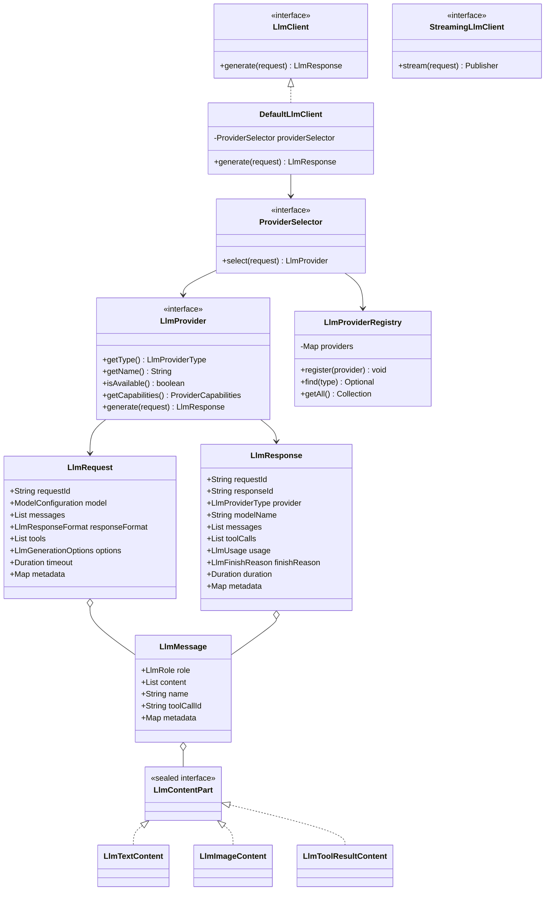

---

# 32. Part 2 Package Structure

```text
src/main/java/kr/co/goms/gomsbook/ai/llm/
├── client/
│   ├── LlmClient.java
│   ├── DefaultLlmClient.java
│   └── StreamingLlmClient.java
│
├── config/
│   └── ModelConfiguration.java
│
├── error/
│   ├── LlmException.java
│   ├── LlmConfigurationException.java
│   ├── LlmProviderNotFoundException.java
│   └── LlmProviderUnavailableException.java
│
├── model/
│   ├── LlmContentPart.java
│   ├── LlmFinishReason.java
│   ├── LlmGenerationOptions.java
│   ├── LlmImageContent.java
│   ├── LlmImageDetail.java
│   ├── LlmMessage.java
│   ├── LlmRequest.java
│   ├── LlmResponse.java
│   ├── LlmResponseFormat.java
│   ├── LlmResponseFormatType.java
│   ├── LlmRole.java
│   ├── LlmTextContent.java
│   ├── LlmToolResultContent.java
│   └── LlmUsage.java
│
├── provider/
│   ├── LlmProvider.java
│   ├── LlmProviderRegistry.java
│   ├── LlmProviderType.java
│   └── ProviderCapabilities.java
│
├── routing/
│   ├── ConfiguredProviderSelector.java
│   └── ProviderSelector.java
│
├── streaming/
│   └── LlmStreamEvent.java
│
└── tool/
    ├── LlmToolCall.java
    └── LlmToolDefinition.java
```

---

# Part 2 Summary

The core LLM model establishes a provider-neutral execution contract.

The principal design rules are:

- Business logic depends on `LlmClient`
- Provider implementations remain behind `LlmProvider`
- Requests and responses use immutable Java records
- Message content supports multiple content types
- Structured output and Tool Calling use provider-neutral models
- Tool Calls are returned but not executed by the LLM Framework
- Provider capabilities are explicitly declared
- Provider-specific SDK types never escape the provider layer
- Streaming uses a separate interface
- Selection and registration are independent from execution

This structure creates the stable foundation required for OpenAI, Gemini, Claude, Ollama, LM Studio, and future provider implementations.


# 33. Provider Adapter Architecture

The Provider Adapter layer converts provider-neutral `LlmRequest` objects into provider-specific API requests and converts provider responses back into normalized `LlmResponse` objects.

The central design rule is:

```text
Common Request Model
        │
        ▼
Provider Adapter
        │
        ▼
Provider-specific API
        │
        ▼
Provider Response
        │
        ▼
Normalized LlmResponse
```

Provider-specific SDK classes must remain inside the provider implementation package.

---

## 33.1 Adapter Responsibilities

Each provider adapter is responsible for:

- Validating provider configuration
- Checking model capabilities
- Mapping message roles
- Mapping generation options
- Mapping response formats
- Mapping Tool definitions
- Executing HTTP or SDK requests
- Parsing provider responses
- Normalizing Tool Calls
- Normalizing token usage
- Normalizing finish reasons
- Mapping provider errors
- Supporting cancellation and timeout
- Preventing credentials from leaking into logs

---

## 33.2 Provider Adapter Flow

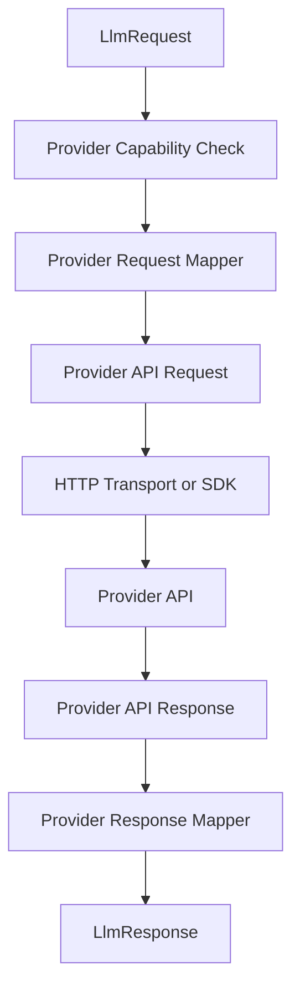

---

# 34. Provider Package Contract

Each provider implementation should use the same internal structure.

```text
provider/
└── openai/
    ├── OpenAiProvider.java
    ├── OpenAiRequestMapper.java
    ├── OpenAiResponseMapper.java
    ├── OpenAiConfiguration.java
    ├── OpenAiModelCapabilities.java
    └── OpenAiErrorMapper.java
```

The same pattern applies to:

- Gemini
- Claude
- Ollama
- LM Studio

---

# 35. Provider Adapter Interface

`ProviderAdapter` separates request mapping and response mapping from the `LlmProvider` execution contract.

```java
package kr.co.goms.gomsbook.ai.llm.provider.adapter;

import kr.co.goms.gomsbook.ai.llm.model.LlmRequest;
import kr.co.goms.gomsbook.ai.llm.model.LlmResponse;

public interface ProviderAdapter<PR, PS> {

    PR mapRequest(LlmRequest request);

    LlmResponse mapResponse(
            LlmRequest originalRequest,
            PS providerResponse
    );
}
```

Where:

- `PR` represents the provider-specific request type
- `PS` represents the provider-specific response type

---

## 35.1 Separate Mapper Interfaces

For implementations requiring stronger separation, use two interfaces.

```java
package kr.co.goms.gomsbook.ai.llm.provider.adapter;

import kr.co.goms.gomsbook.ai.llm.model.LlmRequest;

public interface ProviderRequestMapper<PR> {

    PR map(LlmRequest request);
}
```

```java
package kr.co.goms.gomsbook.ai.llm.provider.adapter;

import kr.co.goms.gomsbook.ai.llm.model.LlmRequest;
import kr.co.goms.gomsbook.ai.llm.model.LlmResponse;

public interface ProviderResponseMapper<PS> {

    LlmResponse map(
            LlmRequest originalRequest,
            PS providerResponse
    );
}
```

This structure is recommended because request and response mapping often evolve independently.

---

# 36. Provider Request Mapping

The request mapper converts the normalized request into a provider-specific representation.

The mapper must handle:

- Model name
- Message roles
- Multimodal content
- Tool definitions
- Tool results
- Response format
- Generation options
- Token limits
- Stop sequences
- Provider metadata

---

## 36.1 Request Mapping Pipeline

```text
LlmRequest
    │
    ▼
Validate Required Capabilities
    │
    ▼
Map Model
    │
    ▼
Map Messages
    │
    ▼
Map Tools
    │
    ▼
Map Response Format
    │
    ▼
Map Generation Options
    │
    ▼
Provider Request
```

---

## 36.2 Capability Validation

Before request mapping, the provider must verify that all required capabilities are supported.

```java
package kr.co.goms.gomsbook.ai.llm.provider.capability;

import java.util.List;

public record CapabilityValidationResult(
        boolean supported,
        List<String> unsupportedCapabilities
) {

    public CapabilityValidationResult {
        unsupportedCapabilities =
                unsupportedCapabilities == null
                        ? List.of()
                        : List.copyOf(unsupportedCapabilities);
    }

    public static CapabilityValidationResult success() {
        return new CapabilityValidationResult(
                true,
                List.of()
        );
    }
}
```

---

## 36.3 Capability Validator

```java
package kr.co.goms.gomsbook.ai.llm.provider.capability;

import kr.co.goms.gomsbook.ai.llm.model.LlmRequest;
import kr.co.goms.gomsbook.ai.llm.provider.ProviderCapabilities;

public interface ProviderCapabilityValidator {

    CapabilityValidationResult validate(
            LlmRequest request,
            ProviderCapabilities capabilities
    );
}
```

---

# 37. Provider Response Mapping

The response mapper converts provider-specific responses into `LlmResponse`.

The mapper must normalize:

- Text output
- Tool Calls
- Response identifiers
- Model identifiers
- Finish reasons
- Usage values
- Safety blocks
- Provider metadata
- Error information

---

## 37.1 Finish Reason Mapping

Provider responses use different finish status values.

The mapper converts them into:

```java
public enum LlmFinishReason {
    STOP,
    LENGTH,
    TOOL_CALL,
    CONTENT_FILTER,
    CANCELLED,
    ERROR,
    UNKNOWN
}
```

Example mapping:

| Provider value | Normalized value |
|---|---|
| `stop` | `STOP` |
| `max_tokens` | `LENGTH` |
| `tool_calls` | `TOOL_CALL` |
| `safety` | `CONTENT_FILTER` |
| Unknown value | `UNKNOWN` |

The original provider value should be retained in response metadata.

---

## 37.2 Usage Mapping

Providers may report:

- Input tokens
- Output tokens
- Cached tokens
- Reasoning tokens
- Total tokens

When a provider does not report exact values, the framework should mark usage as estimated.

```java
package kr.co.goms.gomsbook.ai.llm.model;

public record LlmUsage(
        int inputTokens,
        int outputTokens,
        int totalTokens,
        Integer cachedInputTokens,
        Integer reasoningTokens,
        boolean estimated
) {
}
```

---

# 38. HTTP Transport Layer

Provider implementations should not manage raw HTTP details directly.

A common transport layer improves:

- Timeout handling
- Proxy support
- TLS configuration
- Header handling
- Retry integration
- Logging
- Metrics
- Testability

---

## 38.1 HttpTransport Interface

```java
package kr.co.goms.gomsbook.ai.llm.transport;

public interface HttpTransport {

    HttpResponse execute(HttpRequest request);
}
```

---

## 38.2 HttpRequest

```java
package kr.co.goms.gomsbook.ai.llm.transport;

import java.time.Duration;
import java.util.Map;

public record HttpRequest(
        String method,
        String url,
        Map<String, String> headers,
        String body,
        Duration timeout
) {

    public HttpRequest {
        headers = headers == null
                ? Map.of()
                : Map.copyOf(headers);
    }
}
```

---

## 38.3 HttpResponse

```java
package kr.co.goms.gomsbook.ai.llm.transport;

import java.util.Map;

public record HttpResponse(
        int statusCode,
        Map<String, String> headers,
        String body
) {

    public HttpResponse {
        headers = headers == null
                ? Map.of()
                : Map.copyOf(headers);
    }

    public boolean isSuccessful() {
        return statusCode >= 200 && statusCode < 300;
    }
}
```

---

## 38.4 Transport Requirements

The transport must support:

- Connection timeout
- Read timeout
- Request cancellation
- HTTPS
- Proxy configuration
- Custom headers
- Streaming
- Request identifiers
- Response size limits
- Safe logging

The transport must never log:

- API keys
- Authorization headers
- Full unpublished manuscript content
- Raw credentials
- Sensitive Tool arguments

---

# 39. Provider Configuration

Each provider requires configuration independent from model configuration.

```java
package kr.co.goms.gomsbook.ai.llm.config;

import java.net.URI;
import java.time.Duration;
import java.util.Map;

import kr.co.goms.gomsbook.ai.llm.provider.LlmProviderType;

public record ProviderConfiguration(
        LlmProviderType provider,
        URI baseUri,
        String credentialReference,
        Duration connectTimeout,
        Duration readTimeout,
        boolean enabled,
        Map<String, Object> options
) {

    public ProviderConfiguration {
        options = options == null
                ? Map.of()
                : Map.copyOf(options);

        connectTimeout = connectTimeout == null
                ? Duration.ofSeconds(10)
                : connectTimeout;

        readTimeout = readTimeout == null
                ? Duration.ofSeconds(60)
                : readTimeout;
    }
}
```

The configuration should contain a credential reference, not a raw API key.

---

# 40. Credential Management

Credentials must be resolved through a dedicated abstraction.

```java
package kr.co.goms.gomsbook.ai.llm.security;

import java.util.Optional;

public interface CredentialProvider {

    Optional<Credential> resolve(String reference);
}
```

```java
package kr.co.goms.gomsbook.ai.llm.security;

public record Credential(
        String type,
        char[] secret
) implements AutoCloseable {

    @Override
    public void close() {
        if (secret != null) {
            java.util.Arrays.fill(secret, '\0');
        }
    }
}
```

---

## 40.1 Credential Sources

Supported sources may include:

```text
EnvironmentCredentialProvider
SystemPropertyCredentialProvider
EncryptedFileCredentialProvider
WindowsCredentialManagerProvider
EclipseSecureStorageCredentialProvider
CompositeCredentialProvider
```

For GomsBookEditor, Eclipse Secure Storage or the operating system credential manager is preferable.

---

## 40.2 Credential Rules

- Never store API keys in source code
- Never commit credential files
- Never include secrets in prompt metadata
- Never expose secrets in exceptions
- Mask authorization headers
- Clear temporary secret buffers where practical
- Use project-independent secure storage
- Support provider key rotation

---

# 41. Base Provider Implementation

A shared abstract class can reduce duplicated provider execution logic.

```java
package kr.co.goms.gomsbook.ai.llm.provider.base;

import java.util.Objects;

import kr.co.goms.gomsbook.ai.llm.model.LlmRequest;
import kr.co.goms.gomsbook.ai.llm.model.LlmResponse;
import kr.co.goms.gomsbook.ai.llm.provider.LlmProvider;
import kr.co.goms.gomsbook.ai.llm.provider.ProviderCapabilities;
import kr.co.goms.gomsbook.ai.llm.provider.adapter.ProviderRequestMapper;
import kr.co.goms.gomsbook.ai.llm.provider.adapter.ProviderResponseMapper;
import kr.co.goms.gomsbook.ai.llm.transport.HttpTransport;

public abstract class AbstractHttpLlmProvider<PR, PS>
        implements LlmProvider {

    protected final HttpTransport transport;
    protected final ProviderRequestMapper<PR> requestMapper;
    protected final ProviderResponseMapper<PS> responseMapper;

    protected AbstractHttpLlmProvider(
            HttpTransport transport,
            ProviderRequestMapper<PR> requestMapper,
            ProviderResponseMapper<PS> responseMapper
    ) {
        this.transport = Objects.requireNonNull(transport);
        this.requestMapper = Objects.requireNonNull(requestMapper);
        this.responseMapper = Objects.requireNonNull(responseMapper);
    }

    @Override
    public LlmResponse generate(LlmRequest request) {
        validateRequest(request, getCapabilities());

        PR providerRequest = requestMapper.map(request);

        PS providerResponse = executeProviderRequest(
                providerRequest,
                request
        );

        return responseMapper.map(
                request,
                providerResponse
        );
    }

    protected abstract PS executeProviderRequest(
            PR providerRequest,
            LlmRequest originalRequest
    );

    protected void validateRequest(
            LlmRequest request,
            ProviderCapabilities capabilities
    ) {
        // Provider capability validation
    }
}
```

Composition may be preferred over inheritance when provider behavior differs significantly.

---

# 42. OpenAI Provider Design

The OpenAI provider package should be isolated.

```text
provider/openai/
├── OpenAiProvider.java
├── OpenAiConfiguration.java
├── OpenAiRequestMapper.java
├── OpenAiResponseMapper.java
├── OpenAiErrorMapper.java
├── OpenAiModelCapabilities.java
└── model/
    ├── OpenAiRequest.java
    └── OpenAiResponse.java
```

---

## 42.1 OpenAiProvider

```java
package kr.co.goms.gomsbook.ai.llm.provider.openai;

import kr.co.goms.gomsbook.ai.llm.model.LlmRequest;
import kr.co.goms.gomsbook.ai.llm.model.LlmResponse;
import kr.co.goms.gomsbook.ai.llm.provider.LlmProvider;
import kr.co.goms.gomsbook.ai.llm.provider.LlmProviderType;
import kr.co.goms.gomsbook.ai.llm.provider.ProviderCapabilities;

public final class OpenAiProvider
        implements LlmProvider {

    private final OpenAiConfiguration configuration;
    private final OpenAiRequestMapper requestMapper;
    private final OpenAiResponseMapper responseMapper;
    private final OpenAiApiClient apiClient;

    public OpenAiProvider(
            OpenAiConfiguration configuration,
            OpenAiRequestMapper requestMapper,
            OpenAiResponseMapper responseMapper,
            OpenAiApiClient apiClient
    ) {
        this.configuration = configuration;
        this.requestMapper = requestMapper;
        this.responseMapper = responseMapper;
        this.apiClient = apiClient;
    }

    @Override
    public LlmProviderType getType() {
        return LlmProviderType.OPENAI;
    }

    @Override
    public String getName() {
        return "OpenAI";
    }

    @Override
    public boolean isAvailable() {
        return configuration.enabled()
                && apiClient.isConfigured();
    }

    @Override
    public ProviderCapabilities getCapabilities() {
        return configuration.capabilities();
    }

    @Override
    public LlmResponse generate(LlmRequest request) {
        OpenAiRequest providerRequest =
                requestMapper.map(request);

        OpenAiResponse providerResponse =
                apiClient.execute(providerRequest);

        return responseMapper.map(
                request,
                providerResponse
        );
    }
}
```

The actual API contract should be isolated inside `OpenAiApiClient`.

---

# 43. Gemini Provider Design

```text
provider/gemini/
├── GeminiProvider.java
├── GeminiConfiguration.java
├── GeminiRequestMapper.java
├── GeminiResponseMapper.java
├── GeminiErrorMapper.java
├── GeminiModelCapabilities.java
└── model/
```

The Gemini adapter must handle provider-specific differences such as:

- System instruction representation
- Content and part structures
- Tool declaration format
- Safety configuration
- Candidate responses
- Finish reasons
- Usage metadata

---

# 44. Claude Provider Design

```text
provider/claude/
├── ClaudeProvider.java
├── ClaudeConfiguration.java
├── ClaudeRequestMapper.java
├── ClaudeResponseMapper.java
├── ClaudeErrorMapper.java
├── ClaudeModelCapabilities.java
└── model/
```

The Claude adapter must handle:

- System prompt separation
- Content block mapping
- Tool use blocks
- Tool result blocks
- Stop reasons
- Usage normalization
- Provider-specific limits

---

# 45. Ollama Provider Design

Ollama is a local provider and should be treated differently from cloud providers.

```text
provider/ollama/
├── OllamaProvider.java
├── OllamaConfiguration.java
├── OllamaRequestMapper.java
├── OllamaResponseMapper.java
├── OllamaModelService.java
├── OllamaHealthService.java
└── model/
```

---

## 45.1 Ollama Responsibilities

The Ollama adapter should support:

- Local endpoint configuration
- Model availability checks
- Model listing
- Model pull status
- Streaming
- Local embeddings
- Context-window configuration
- JSON output when supported
- Model-specific capability detection

---

## 45.2 Ollama Health Check

```java
package kr.co.goms.gomsbook.ai.llm.provider.ollama;

public interface OllamaHealthService {

    boolean isRunning();

    boolean isModelAvailable(String modelName);
}
```

---

# 46. LM Studio Provider Design

LM Studio commonly exposes an OpenAI-compatible local endpoint.

However, it should still have its own provider implementation because:

- Capabilities depend on the loaded model
- Tool Calling support may vary
- JSON Schema support may vary
- Model discovery differs
- Local security policies differ
- Endpoint configuration differs

```text
provider/lmstudio/
├── LmStudioProvider.java
├── LmStudioConfiguration.java
├── LmStudioRequestMapper.java
├── LmStudioResponseMapper.java
├── LmStudioHealthService.java
└── model/
```

An OpenAI-compatible transport implementation may be reused internally.

---

# 47. OpenAI-Compatible Provider Base

Ollama, LM Studio, and other services may expose OpenAI-compatible APIs.

A reusable internal adapter can reduce duplication.

```java
package kr.co.goms.gomsbook.ai.llm.provider.compatible;

public interface OpenAiCompatibleEndpoint {

    String baseUrl();

    String chatEndpoint();

    String modelsEndpoint();

    boolean supportsTools();

    boolean supportsJsonSchema();
}
```

Compatibility must not be assumed solely because endpoint paths are similar.

Capabilities must be detected or configured explicitly.

---

# 48. Provider Error Mapping

Provider-specific errors must be converted into common error types.

---

## 48.1 Common Error Types

```java
package kr.co.goms.gomsbook.ai.llm.error;

public enum LlmErrorType {
    AUTHENTICATION,
    AUTHORIZATION,
    RATE_LIMIT,
    INVALID_REQUEST,
    MODEL_NOT_FOUND,
    MODEL_UNAVAILABLE,
    CONTEXT_LIMIT,
    CONTENT_FILTER,
    TIMEOUT,
    CONNECTION,
    PROVIDER_INTERNAL,
    CANCELLED,
    UNSUPPORTED_CAPABILITY,
    UNKNOWN
}
```

---

## 48.2 LlmProviderException

```java
package kr.co.goms.gomsbook.ai.llm.error;

import java.time.Duration;
import java.util.Map;

import kr.co.goms.gomsbook.ai.llm.provider.LlmProviderType;

public class LlmProviderException
        extends LlmException {

    private final LlmProviderType provider;
    private final LlmErrorType errorType;
    private final String providerErrorCode;
    private final boolean retryable;
    private final Duration retryAfter;
    private final Map<String, String> metadata;

    public LlmProviderException(
            String message,
            LlmProviderType provider,
            LlmErrorType errorType,
            String providerErrorCode,
            boolean retryable,
            Duration retryAfter,
            Map<String, String> metadata,
            Throwable cause
    ) {
        super(message, cause);
        this.provider = provider;
        this.errorType = errorType;
        this.providerErrorCode = providerErrorCode;
        this.retryable = retryable;
        this.retryAfter = retryAfter;
        this.metadata = metadata == null
                ? Map.of()
                : Map.copyOf(metadata);
    }

    public LlmProviderType provider() {
        return provider;
    }

    public LlmErrorType errorType() {
        return errorType;
    }

    public String providerErrorCode() {
        return providerErrorCode;
    }

    public boolean retryable() {
        return retryable;
    }

    public Duration retryAfter() {
        return retryAfter;
    }

    public Map<String, String> metadata() {
        return metadata;
    }
}
```

---

## 48.3 Error Mapper Interface

```java
package kr.co.goms.gomsbook.ai.llm.provider.error;

import kr.co.goms.gomsbook.ai.llm.error.LlmProviderException;

public interface ProviderErrorMapper<E> {

    LlmProviderException map(E providerError);
}
```

---

# 49. Retry Classification

The provider layer should classify errors but should not independently perform unlimited retries.

Retryable errors may include:

- Rate limit
- Temporary provider unavailability
- Connection reset
- Gateway timeout
- Temporary model loading
- Local endpoint startup delay

Non-retryable errors may include:

- Invalid API key
- Unsupported model
- Invalid request schema
- Context window exceeded
- Content policy block
- Unsupported capability
- User cancellation

The central retry coordinator should make the final retry decision.

---

# 50. Provider Availability

Provider availability should be checked without sending user content.

```java
package kr.co.goms.gomsbook.ai.llm.provider;

public interface ProviderHealthIndicator {

    ProviderHealth check();
}
```

```java
package kr.co.goms.gomsbook.ai.llm.provider;

import java.time.Instant;
import java.util.List;

public record ProviderHealth(
        ProviderHealthStatus status,
        Instant checkedAt,
        List<String> messages
) {

    public ProviderHealth {
        messages = messages == null
                ? List.of()
                : List.copyOf(messages);
    }
}
```

```java
package kr.co.goms.gomsbook.ai.llm.provider;

public enum ProviderHealthStatus {
    AVAILABLE,
    DEGRADED,
    UNAVAILABLE,
    UNKNOWN
}
```

---

# 51. Model Discovery

Local and cloud providers may expose different model discovery mechanisms.

```java
package kr.co.goms.gomsbook.ai.llm.model.discovery;

import java.util.List;

public interface ModelDiscoveryService {

    List<AvailableModel> listModels();
}
```

```java
package kr.co.goms.gomsbook.ai.llm.model.discovery;

import java.util.Map;
import java.util.Set;

import kr.co.goms.gomsbook.ai.llm.provider.LlmProviderType;

public record AvailableModel(
        LlmProviderType provider,
        String modelId,
        String displayName,
        int contextWindow,
        Set<ModelCapability> capabilities,
        Map<String, String> metadata
) {

    public AvailableModel {
        capabilities = capabilities == null
                ? Set.of()
                : Set.copyOf(capabilities);

        metadata = metadata == null
                ? Map.of()
                : Map.copyOf(metadata);
    }
}
```

```java
package kr.co.goms.gomsbook.ai.llm.model.discovery;

public enum ModelCapability {
    CHAT,
    STREAMING,
    TOOL_CALLING,
    JSON_OUTPUT,
    JSON_SCHEMA,
    VISION,
    EMBEDDING,
    LOCAL_EXECUTION
}
```

---

# 52. Provider Configuration Example

```yaml
llm:
  providers:
    openai:
      enabled: true
      baseUri: provider-default
      credentialReference: secure://openai/api-key
      connectTimeoutSeconds: 10
      readTimeoutSeconds: 90

    gemini:
      enabled: false
      credentialReference: secure://gemini/api-key

    ollama:
      enabled: true
      baseUri: http://localhost:11434
      connectTimeoutSeconds: 5
      readTimeoutSeconds: 180

    lmStudio:
      enabled: false
      baseUri: http://localhost:1234
```

Actual secrets must not be stored in the configuration file.

---

# 53. Provider Execution Sequence Diagram

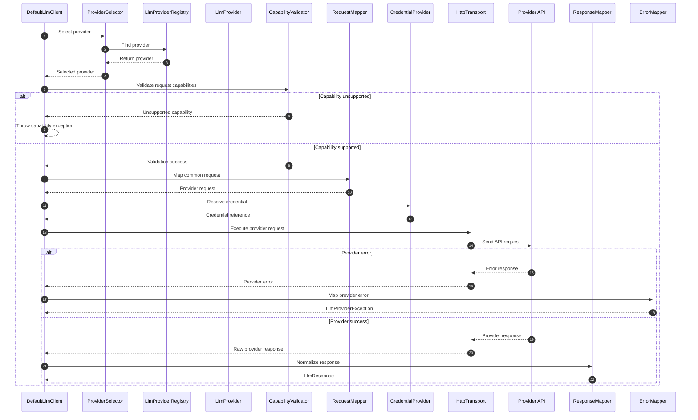

---

# 54. Provider Adapter Class Diagram

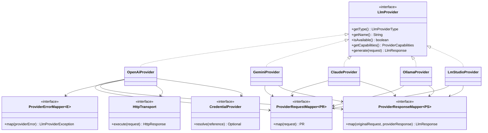

---

# 55. Part 3 Package Structure

```text
src/main/java/kr/co/goms/gomsbook/ai/llm/
├── config/
│   ├── ProviderConfiguration.java
│   └── ProviderConfigurationRepository.java
│
├── error/
│   ├── LlmErrorType.java
│   └── LlmProviderException.java
│
├── model/
│   └── discovery/
│       ├── AvailableModel.java
│       ├── ModelCapability.java
│       └── ModelDiscoveryService.java
│
├── provider/
│   ├── ProviderHealth.java
│   ├── ProviderHealthIndicator.java
│   ├── ProviderHealthStatus.java
│   │
│   ├── adapter/
│   │   ├── ProviderAdapter.java
│   │   ├── ProviderRequestMapper.java
│   │   └── ProviderResponseMapper.java
│   │
│   ├── base/
│   │   └── AbstractHttpLlmProvider.java
│   │
│   ├── capability/
│   │   ├── CapabilityValidationResult.java
│   │   └── ProviderCapabilityValidator.java
│   │
│   ├── compatible/
│   │   └── OpenAiCompatibleEndpoint.java
│   │
│   ├── error/
│   │   └── ProviderErrorMapper.java
│   │
│   ├── openai/
│   │   ├── OpenAiApiClient.java
│   │   ├── OpenAiConfiguration.java
│   │   ├── OpenAiErrorMapper.java
│   │   ├── OpenAiModelCapabilities.java
│   │   ├── OpenAiProvider.java
│   │   ├── OpenAiRequestMapper.java
│   │   └── OpenAiResponseMapper.java
│   │
│   ├── gemini/
│   │   ├── GeminiConfiguration.java
│   │   ├── GeminiErrorMapper.java
│   │   ├── GeminiProvider.java
│   │   ├── GeminiRequestMapper.java
│   │   └── GeminiResponseMapper.java
│   │
│   ├── claude/
│   │   ├── ClaudeConfiguration.java
│   │   ├── ClaudeErrorMapper.java
│   │   ├── ClaudeProvider.java
│   │   ├── ClaudeRequestMapper.java
│   │   └── ClaudeResponseMapper.java
│   │
│   ├── ollama/
│   │   ├── OllamaConfiguration.java
│   │   ├── OllamaHealthService.java
│   │   ├── OllamaModelService.java
│   │   ├── OllamaProvider.java
│   │   ├── OllamaRequestMapper.java
│   │   └── OllamaResponseMapper.java
│   │
│   └── lmstudio/
│       ├── LmStudioConfiguration.java
│       ├── LmStudioHealthService.java
│       ├── LmStudioProvider.java
│       ├── LmStudioRequestMapper.java
│       └── LmStudioResponseMapper.java
│
├── security/
│   ├── Credential.java
│   ├── CredentialProvider.java
│   ├── CompositeCredentialProvider.java
│   └── SecureStorageCredentialProvider.java
│
└── transport/
    ├── HttpRequest.java
    ├── HttpResponse.java
    ├── HttpTransport.java
    └── JavaHttpClientTransport.java
```

---

# Part 3 Summary

The Provider Adapter layer isolates all provider-specific behavior from the rest of GomsBook AI Agent.

The core rules are:

- Common requests are mapped into provider-specific requests
- Provider SDK and API models never escape the provider package
- Responses are normalized into `LlmResponse`
- Provider capabilities are validated before execution
- Credentials are resolved through secure references
- HTTP communication uses a shared transport layer
- Local providers have independent health and model-discovery services
- OpenAI-compatible endpoints are not assumed to have identical capabilities
- Provider errors are mapped into common exception types
- Retry decisions remain under central coordination
- Logs must not expose credentials or unpublished manuscript content

This architecture allows OpenAI, Gemini, Claude, Ollama, LM Studio, and future providers to be added or replaced without modifying the Prompt, Tool, EPUB, or Editor layers.


# 56. Retry and Fallback Strategy

The LLM Framework must treat retries and provider fallback as controlled reliability mechanisms.

A retry repeats execution against the same provider after a recoverable failure.

A fallback selects a different provider or model when the original provider cannot complete the request safely or reliably.

These mechanisms must remain separate because they solve different problems.

```text
Retry
=
Same provider
+
Same task
+
Recoverable failure

Fallback
=
Different provider or model
+
Capability or availability failure
```

---

## 56.1 Retry Conditions

Retry may be allowed for:

- Temporary connection failure
- Provider timeout
- Rate limit
- Temporary model loading
- Gateway errors
- Transient local endpoint failure
- Recoverable streaming interruption
- Provider-declared retryable errors

Retry must not be used for:

- Invalid API credentials
- Unsupported model
- Unsupported capability
- Invalid request schema
- Content safety block
- User cancellation
- Context window overflow
- Security policy violation
- Destructive Tool request without approval

---

## 56.2 Retry Policy

```java
package kr.co.goms.gomsbook.ai.llm.retry;

import java.time.Duration;
import java.util.Set;

import kr.co.goms.gomsbook.ai.llm.error.LlmErrorType;

public record LlmRetryPolicy(
        int maxAttempts,
        Duration initialDelay,
        double backoffMultiplier,
        Duration maxDelay,
        Set<LlmErrorType> retryableErrors
) {

    public LlmRetryPolicy {
        if (maxAttempts < 1) {
            throw new IllegalArgumentException(
                    "maxAttempts must be at least 1."
            );
        }

        if (backoffMultiplier < 1.0) {
            throw new IllegalArgumentException(
                    "backoffMultiplier must be at least 1.0."
            );
        }

        retryableErrors = retryableErrors == null
                ? Set.of()
                : Set.copyOf(retryableErrors);
    }
}
```

Recommended initial policy:

```java
new LlmRetryPolicy(
        3,
        Duration.ofMillis(500),
        2.0,
        Duration.ofSeconds(4),
        Set.of(
                LlmErrorType.RATE_LIMIT,
                LlmErrorType.TIMEOUT,
                LlmErrorType.CONNECTION,
                LlmErrorType.PROVIDER_INTERNAL,
                LlmErrorType.MODEL_UNAVAILABLE
        )
);
```

---

## 56.3 Retry Coordinator

```java
package kr.co.goms.gomsbook.ai.llm.retry;

import java.util.function.Supplier;

import kr.co.goms.gomsbook.ai.llm.model.LlmResponse;

public interface LlmRetryCoordinator {

    LlmResponse execute(
            Supplier<LlmResponse> operation,
            LlmRetryPolicy policy
    );
}
```

The coordinator should:

- Classify the exception
- Check the retry policy
- Respect provider `Retry-After` values
- Apply exponential backoff
- Stop on user cancellation
- Record retry metadata
- Avoid duplicate Tool execution
- Avoid retrying non-idempotent external actions

---

# 57. Provider Fallback

Fallback selects another provider or model when the current target cannot satisfy the request.

Fallback may be triggered by:

- Provider unavailable
- Model unavailable
- Required capability unsupported
- Local model not loaded
- Context window too small
- Cost threshold exceeded
- Latency threshold exceeded
- Security policy requiring local execution
- Provider circuit breaker open

Fallback must not silently weaken security or output guarantees.

---

## 57.1 Fallback Policy

```java
package kr.co.goms.gomsbook.ai.llm.routing;

import java.util.List;

import kr.co.goms.gomsbook.ai.llm.provider.LlmProviderType;

public record FallbackPolicy(
        boolean enabled,
        List<LlmProviderType> providerOrder,
        boolean allowModelDowngrade,
        boolean preserveStructuredOutput,
        boolean preserveToolCalling,
        boolean preserveLocalOnlyPolicy
) {

    public FallbackPolicy {
        providerOrder = providerOrder == null
                ? List.of()
                : List.copyOf(providerOrder);
    }
}
```

---

## 57.2 Fallback Rules

A fallback candidate must satisfy all required conditions:

- Provider is enabled
- Provider is healthy
- Model exists
- Context window is sufficient
- Required capabilities are supported
- Security policy permits the provider
- Output format can be preserved
- Tool definitions are supported when required
- Project local-only policy is respected

---

## 57.3 Retry and Fallback Flow

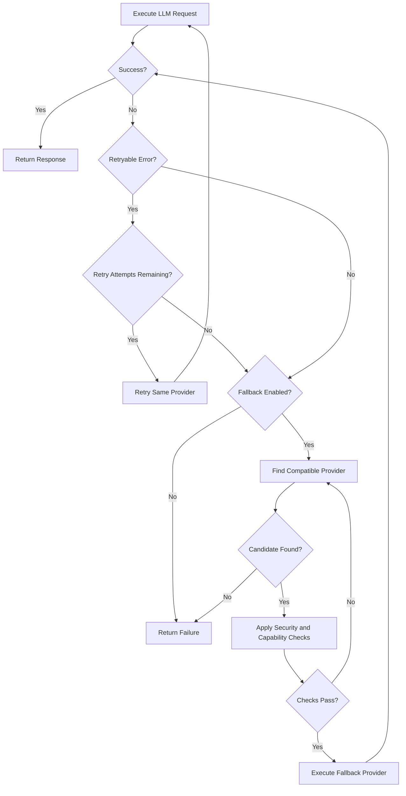

---

# 58. Provider Routing Policy

Provider routing determines which provider and model should execute a request.

Routing should be policy-driven rather than hard-coded.

---

## 58.1 Routing Factors

The routing policy may consider:

- Explicit user selection
- Project local-only setting
- Data sensitivity
- Required capabilities
- Model context window
- Expected response format
- Tool Calling requirements
- Model availability
- Provider health
- Cost limit
- Latency target
- Quality tier
- User preference
- Fallback policy

---

## 58.2 Routing Request

```java
package kr.co.goms.gomsbook.ai.llm.routing;

import java.util.Set;

import kr.co.goms.gomsbook.ai.llm.model.LlmRequest;
import kr.co.goms.gomsbook.ai.llm.model.discovery.ModelCapability;

public record ProviderRoutingRequest(
        LlmRequest request,
        Set<ModelCapability> requiredCapabilities,
        boolean localOnly,
        boolean containsSensitiveContent,
        Long maximumEstimatedCostMicros,
        Long maximumLatencyMillis
) {

    public ProviderRoutingRequest {
        requiredCapabilities =
                requiredCapabilities == null
                        ? Set.of()
                        : Set.copyOf(requiredCapabilities);
    }
}
```

---

## 58.3 Routing Decision

```java
package kr.co.goms.gomsbook.ai.llm.routing;

import java.util.List;

import kr.co.goms.gomsbook.ai.llm.config.ModelConfiguration;

public record ProviderRoutingDecision(
        ModelConfiguration selectedModel,
        List<ModelConfiguration> fallbackModels,
        String reason
) {

    public ProviderRoutingDecision {
        fallbackModels = fallbackModels == null
                ? List.of()
                : List.copyOf(fallbackModels);
    }
}
```

---

## 58.4 Routing Strategy

```java
package kr.co.goms.gomsbook.ai.llm.routing;

public interface RoutingStrategy {

    ProviderRoutingDecision route(
            ProviderRoutingRequest request
    );
}
```

---

# 59. Local-First Routing

GomsBook AI Agent should support a local-first mode for unpublished manuscripts and sensitive publishing projects.

```text
Sensitive Content
      │
      ▼
Local Model Available?
      │
      ├── Yes → Execute Locally
      │
      └── No → Ask User Before Cloud Fallback
```

---

## 59.1 Local-First Policy

```java
package kr.co.goms.gomsbook.ai.llm.routing;

public record LocalFirstPolicy(
        boolean enabled,
        boolean requireLocalForSensitiveContent,
        boolean allowCloudFallback,
        boolean requireConfirmationBeforeCloudFallback
) {
}
```

---

## 59.2 Recommended Behavior

```text
Local provider available
→ Use local provider

Local provider unavailable
+
Cloud fallback disabled
→ Return controlled error

Local provider unavailable
+
Cloud fallback allowed
+
Sensitive content
→ Require explicit user confirmation

Local provider unavailable
+
Cloud fallback allowed
+
Non-sensitive content
→ Select compatible cloud provider
```

---

# 60. Streaming Architecture

Streaming improves responsiveness for long generation tasks.

The framework should expose normalized stream events independent of provider-specific stream formats.

---

## 60.1 Stream Event Model

```java
package kr.co.goms.gomsbook.ai.llm.streaming;

public sealed interface LlmStreamEvent
        permits LlmStreamStarted,
                LlmTextDelta,
                LlmToolCallDelta,
                LlmUsageUpdate,
                LlmStreamCompleted,
                LlmStreamFailed {
}
```

---

## 60.2 Stream Started

```java
package kr.co.goms.gomsbook.ai.llm.streaming;

import kr.co.goms.gomsbook.ai.llm.provider.LlmProviderType;

public record LlmStreamStarted(
        String requestId,
        String responseId,
        LlmProviderType provider,
        String modelName
) implements LlmStreamEvent {
}
```

---

## 60.3 Text Delta

```java
package kr.co.goms.gomsbook.ai.llm.streaming;

public record LlmTextDelta(
        String text
) implements LlmStreamEvent {
}
```

---

## 60.4 Tool Call Delta

```java
package kr.co.goms.gomsbook.ai.llm.streaming;

public record LlmToolCallDelta(
        String toolCallId,
        String toolName,
        String argumentsDelta
) implements LlmStreamEvent {
}
```

---

## 60.5 Usage Update

```java
package kr.co.goms.gomsbook.ai.llm.streaming;

import kr.co.goms.gomsbook.ai.llm.model.LlmUsage;

public record LlmUsageUpdate(
        LlmUsage usage
) implements LlmStreamEvent {
}
```

---

## 60.6 Stream Completed

```java
package kr.co.goms.gomsbook.ai.llm.streaming;

import kr.co.goms.gomsbook.ai.llm.model.LlmResponse;

public record LlmStreamCompleted(
        LlmResponse response
) implements LlmStreamEvent {
}
```

---

## 60.7 Stream Failed

```java
package kr.co.goms.gomsbook.ai.llm.streaming;

import kr.co.goms.gomsbook.ai.llm.error.LlmErrorType;

public record LlmStreamFailed(
        LlmErrorType errorType,
        String message,
        boolean retryable
) implements LlmStreamEvent {
}
```

---

## 60.8 Streaming Rules

- Partial text must not be treated as a validated final result
- Partial Tool arguments must not be executed
- Tool Calls may run only after the complete argument payload is parsed
- Cancellation must stop UI updates and provider execution
- Final validation runs only after stream completion
- Partial content may be displayed as preview
- Interrupted streams must be marked incomplete
- Repair should use the complete retained partial response only when safe

---

# 61. Cancellation

Every long-running LLM request should support cancellation.

---

## 61.1 Cancellation Token

```java
package kr.co.goms.gomsbook.ai.llm.execution;

public interface CancellationToken {

    boolean isCancellationRequested();

    void throwIfCancellationRequested();
}
```

---

## 61.2 Execution Context

```java
package kr.co.goms.gomsbook.ai.llm.execution;

import java.time.Instant;
import java.util.Map;

public record LlmExecutionContext(
        String executionId,
        String requestId,
        Instant startedAt,
        CancellationToken cancellationToken,
        Map<String, Object> attributes
) {

    public LlmExecutionContext {
        attributes = attributes == null
                ? Map.of()
                : Map.copyOf(attributes);
    }
}
```

---

## 61.3 Cancellation Rules

Cancellation must:

- Stop pending retries
- Stop fallback attempts
- Close streaming connections
- Avoid returning partial content as complete
- Record cancellation status
- Prevent Tool execution after cancellation
- Release local model resources where practical

---

# 62. Token Management

Token management estimates prompt size and ensures that requests fit within model limits.

The framework should account for:

- System messages
- User messages
- Tool definitions
- Output schemas
- Retrieved context
- Expected output tokens
- Provider-specific message overhead

---

## 62.1 Token Counter

```java
package kr.co.goms.gomsbook.ai.llm.token;

import kr.co.goms.gomsbook.ai.llm.model.LlmRequest;

public interface TokenCounter {

    TokenEstimate estimate(LlmRequest request);
}
```

---

## 62.2 Token Estimate

```java
package kr.co.goms.gomsbook.ai.llm.token;

public record TokenEstimate(
        int inputTokens,
        int reservedOutputTokens,
        int totalEstimatedTokens,
        boolean exact
) {
}
```

---

## 62.3 Context Limit Validator

```java
package kr.co.goms.gomsbook.ai.llm.token;

import kr.co.goms.gomsbook.ai.llm.config.ModelConfiguration;

public interface ContextLimitValidator {

    ContextLimitValidationResult validate(
            TokenEstimate estimate,
            ModelConfiguration model
    );
}
```

```java
package kr.co.goms.gomsbook.ai.llm.token;

public record ContextLimitValidationResult(
        boolean valid,
        int excessTokens,
        String message
) {
}
```

---

## 62.4 Context Overflow Strategy

When a request exceeds the model context window:

```text
1. Remove duplicate retrieved content
2. Reduce low-priority RAG chunks
3. Compress project context
4. Shorten examples
5. Reduce optional Tool descriptions
6. Split the task
7. Select a larger-context model
8. Ask the user to narrow the request
```

The framework must not silently remove:

- System safety rules
- Output schema
- Approval requirements
- Required user constraints
- Tool permission rules

---

# 63. Cost Monitoring

Cost monitoring should be optional but supported for cloud providers.

The framework should estimate cost before execution and calculate actual cost after usage data is available.

---

## 63.1 Model Pricing

```java
package kr.co.goms.gomsbook.ai.llm.cost;

import java.math.BigDecimal;

public record ModelPricing(
        String provider,
        String modelName,
        BigDecimal inputCostPerMillionTokens,
        BigDecimal outputCostPerMillionTokens,
        BigDecimal cachedInputCostPerMillionTokens,
        String currency
) {
}
```

---

## 63.2 Cost Estimate

```java
package kr.co.goms.gomsbook.ai.llm.cost;

import java.math.BigDecimal;

public record LlmCostEstimate(
        BigDecimal estimatedInputCost,
        BigDecimal estimatedOutputCost,
        BigDecimal estimatedTotalCost,
        String currency
) {
}
```

---

## 63.3 Cost Calculator

```java
package kr.co.goms.gomsbook.ai.llm.cost;

import kr.co.goms.gomsbook.ai.llm.model.LlmUsage;

public interface LlmCostCalculator {

    LlmCostEstimate estimate(
            ModelPricing pricing,
            int estimatedInputTokens,
            int estimatedOutputTokens
    );

    LlmCostEstimate calculate(
            ModelPricing pricing,
            LlmUsage usage
    );
}
```

---

## 63.4 Cost Policy

```java
package kr.co.goms.gomsbook.ai.llm.cost;

import java.math.BigDecimal;

public record LlmCostPolicy(
        BigDecimal maximumCostPerRequest,
        BigDecimal dailyBudget,
        boolean requireConfirmationAboveThreshold
) {
}
```

---

## 63.5 Cost Rules

- Pricing data must be versioned
- Unknown pricing must not be treated as free
- Local execution may have zero API cost but still consumes local resources
- Cost estimates should be labeled as estimates
- The user should be warned before unusually expensive operations
- Retries and fallback costs must be included
- Sensitive content must not be logged with cost records

---

# 64. Rate Limiting

Rate limiting protects providers and prevents accidental request bursts.

---

## 64.1 Rate Limit Policy

```java
package kr.co.goms.gomsbook.ai.llm.rate;

import java.time.Duration;

public record RateLimitPolicy(
        int maximumRequests,
        Duration window,
        int maximumConcurrentRequests
) {
}
```

---

## 64.2 Rate Limiter

```java
package kr.co.goms.gomsbook.ai.llm.rate;

public interface LlmRateLimiter {

    RateLimitDecision acquire(
            String provider,
            String model
    );
}
```

```java
package kr.co.goms.gomsbook.ai.llm.rate;

import java.time.Duration;

public record RateLimitDecision(
        boolean allowed,
        Duration retryAfter,
        String reason
) {
}
```

---

## 64.3 Rate Limit Scope

Rate limits may be applied by:

- Provider
- Model
- User
- Project
- Operation type
- API credential
- Local model process

---

# 65. Circuit Breaker

A circuit breaker prevents repeated calls to an unhealthy provider.

---

## 65.1 Circuit States

```java
package kr.co.goms.gomsbook.ai.llm.resilience;

public enum CircuitState {
    CLOSED,
    OPEN,
    HALF_OPEN
}
```

```text
CLOSED
→ Requests allowed

OPEN
→ Requests blocked temporarily

HALF_OPEN
→ Limited test requests allowed
```

---

## 65.2 Circuit Breaker Policy

```java
package kr.co.goms.gomsbook.ai.llm.resilience;

import java.time.Duration;

public record CircuitBreakerPolicy(
        int failureThreshold,
        Duration openDuration,
        int halfOpenMaximumCalls
) {
}
```

---

## 65.3 Circuit Breaker Interface

```java
package kr.co.goms.gomsbook.ai.llm.resilience;

import java.util.function.Supplier;

public interface LlmCircuitBreaker {

    <T> T execute(
            String providerKey,
            Supplier<T> operation
    );

    CircuitState state(String providerKey);
}
```

---

# 66. Observability

Every LLM request should produce operational metadata.

Recommended metrics:

- Request count
- Success count
- Failure count
- Retry count
- Fallback count
- Cancellation count
- Average latency
- Token usage
- Estimated cost
- Tool Call count
- Streaming duration
- Provider health
- Circuit breaker state

---

## 66.1 Execution Metrics

```java
package kr.co.goms.gomsbook.ai.llm.monitoring;

import java.time.Duration;

import kr.co.goms.gomsbook.ai.llm.provider.LlmProviderType;

public record LlmExecutionMetrics(
        String executionId,
        LlmProviderType provider,
        String modelName,
        boolean success,
        int retryCount,
        int fallbackCount,
        int inputTokens,
        int outputTokens,
        Duration duration
) {
}
```

---

## 66.2 Metrics Recorder

```java
package kr.co.goms.gomsbook.ai.llm.monitoring;

public interface LlmMetricsRecorder {

    void record(LlmExecutionMetrics metrics);
}
```

---

## 66.3 Logging Rules

Logs may include:

- Request ID
- Execution ID
- Provider
- Model
- Duration
- Token counts
- Retry count
- Fallback provider
- Error category
- Finish reason

Logs must not include by default:

- API keys
- Authorization headers
- Full manuscript text
- Raw Tool arguments
- Personal information
- Full local paths
- Hidden system instructions

---

# 67. LLM Security Policy

Security policy determines whether a request may be sent to a provider.

---

## 67.1 Security Request

```java
package kr.co.goms.gomsbook.ai.llm.security;

import java.util.Set;

import kr.co.goms.gomsbook.ai.llm.provider.LlmProviderType;

public record LlmSecurityRequest(
        LlmProviderType provider,
        boolean localProvider,
        Set<String> dataCategories,
        boolean containsSensitiveContent,
        boolean containsCredentials,
        boolean userConfirmedCloudTransmission
) {

    public LlmSecurityRequest {
        dataCategories = dataCategories == null
                ? Set.of()
                : Set.copyOf(dataCategories);
    }
}
```

---

## 67.2 Security Decision

```java
package kr.co.goms.gomsbook.ai.llm.security;

import java.util.List;

public record LlmSecurityDecision(
        boolean allowed,
        boolean requiresConfirmation,
        List<String> reasons
) {

    public LlmSecurityDecision {
        reasons = reasons == null
                ? List.of()
                : List.copyOf(reasons);
    }
}
```

---

## 67.3 Security Policy Interface

```java
package kr.co.goms.gomsbook.ai.llm.security;

public interface LlmSecurityPolicy {

    LlmSecurityDecision evaluate(
            LlmSecurityRequest request
    );
}
```

---

## 67.4 Recommended Security Rules

```text
Credential detected in prompt
→ Block

Sensitive manuscript + local provider
→ Allow according to project policy

Sensitive manuscript + cloud provider + no confirmation
→ Require confirmation

Unknown external provider
→ Block

Provider does not support required security controls
→ Reject provider

Local-only project + cloud fallback
→ Block
```

---

# 68. Resilient Execution Coordinator

The execution coordinator combines routing, security, rate limiting, retry, fallback, circuit breaker, metrics, and cancellation.

```java
package kr.co.goms.gomsbook.ai.llm.execution;

import kr.co.goms.gomsbook.ai.llm.model.LlmRequest;
import kr.co.goms.gomsbook.ai.llm.model.LlmResponse;

public interface LlmExecutionCoordinator {

    LlmResponse execute(
            LlmExecutionContext context,
            LlmRequest request
    );
}
```

---

## 68.1 Coordinator Responsibilities

```text
1. Validate request
2. Evaluate security policy
3. Select provider
4. Check provider health
5. Check circuit breaker
6. Check rate limit
7. Estimate tokens and cost
8. Execute provider
9. Retry when allowed
10. Fallback when allowed
11. Normalize response
12. Record metrics and audit metadata
```

---

# 69. Failure Recovery Sequence Diagram

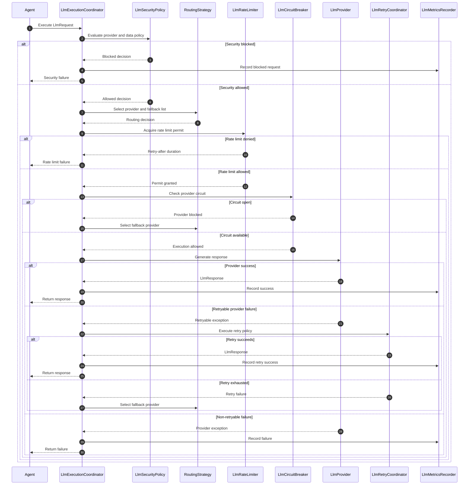

---

# 70. Resilience Class Diagram

```mermaid
classDiagram
    direction TB

    class LlmExecutionCoordinator {
        <<interface>>
        +execute(context, request) LlmResponse
    }

    class RoutingStrategy {
        <<interface>>
        +route(request) ProviderRoutingDecision
    }

    class LlmSecurityPolicy {
        <<interface>>
        +evaluate(request) LlmSecurityDecision
    }

    class LlmRateLimiter {
        <<interface>>
        +acquire(provider, model) RateLimitDecision
    }

    class LlmCircuitBreaker {
        <<interface>>
        +execute(providerKey, operation) Object
        +state(providerKey) CircuitState
    }

    class LlmRetryCoordinator {
        <<interface>>
        +execute(operation, policy) LlmResponse
    }

    class TokenCounter {
        <<interface>>
        +estimate(request) TokenEstimate
    }

    class LlmCostCalculator {
        <<interface>>
        +estimate(pricing, inputTokens, outputTokens) LlmCostEstimate
        +calculate(pricing, usage) LlmCostEstimate
    }

    class LlmMetricsRecorder {
        <<interface>>
        +record(metrics) void
    }

    class DefaultLlmExecutionCoordinator

    LlmExecutionCoordinator <|.. DefaultLlmExecutionCoordinator

    DefaultLlmExecutionCoordinator --> RoutingStrategy
    DefaultLlmExecutionCoordinator --> LlmSecurityPolicy
    DefaultLlmExecutionCoordinator --> LlmRateLimiter
    DefaultLlmExecutionCoordinator --> LlmCircuitBreaker
    DefaultLlmExecutionCoordinator --> LlmRetryCoordinator
    DefaultLlmExecutionCoordinator --> TokenCounter
    DefaultLlmExecutionCoordinator --> LlmCostCalculator
    DefaultLlmExecutionCoordinator --> LlmMetricsRecorder
```

---

# 71. Part 4 Package Structure

```text
src/main/java/kr/co/goms/gomsbook/ai/llm/
├── cost/
│   ├── LlmCostCalculator.java
│   ├── LlmCostEstimate.java
│   ├── LlmCostPolicy.java
│   └── ModelPricing.java
│
├── execution/
│   ├── CancellationToken.java
│   ├── LlmExecutionContext.java
│   ├── LlmExecutionCoordinator.java
│   └── DefaultLlmExecutionCoordinator.java
│
├── monitoring/
│   ├── LlmExecutionMetrics.java
│   └── LlmMetricsRecorder.java
│
├── rate/
│   ├── LlmRateLimiter.java
│   ├── RateLimitDecision.java
│   └── RateLimitPolicy.java
│
├── resilience/
│   ├── CircuitBreakerPolicy.java
│   ├── CircuitState.java
│   └── LlmCircuitBreaker.java
│
├── retry/
│   ├── LlmRetryCoordinator.java
│   └── LlmRetryPolicy.java
│
├── routing/
│   ├── FallbackPolicy.java
│   ├── LocalFirstPolicy.java
│   ├── ProviderRoutingDecision.java
│   ├── ProviderRoutingRequest.java
│   └── RoutingStrategy.java
│
├── security/
│   ├── LlmSecurityDecision.java
│   ├── LlmSecurityPolicy.java
│   └── LlmSecurityRequest.java
│
├── streaming/
│   ├── LlmStreamCompleted.java
│   ├── LlmStreamEvent.java
│   ├── LlmStreamFailed.java
│   ├── LlmStreamStarted.java
│   ├── LlmTextDelta.java
│   ├── LlmToolCallDelta.java
│   └── LlmUsageUpdate.java
│
└── token/
    ├── ContextLimitValidationResult.java
    ├── ContextLimitValidator.java
    ├── TokenCounter.java
    └── TokenEstimate.java
```

---

# Part 4 Summary

The resilience and operations layer ensures that LLM execution remains reliable, observable, secure, and cost-aware.

The central rules are:

- Retry and fallback are separate mechanisms
- Only explicitly retryable errors may be retried
- Fallback providers must preserve required capabilities and security policy
- Sensitive projects should support local-first routing
- Streaming output is provisional until completion and validation
- Cancellation must stop retries, fallback, and Tool execution
- Token limits must be checked before provider execution
- Cloud cost must be estimated and monitored
- Rate limiting protects providers and credentials
- Circuit breakers prevent repeated calls to unhealthy providers
- Metrics must not expose manuscript content or credentials
- Security policy must evaluate every cloud transmission
- A central execution coordinator should combine resilience policies consistently


# 72. LLM Evaluation Strategy

The LLM Framework must be evaluated as an execution platform rather than only by subjective answer quality.

Evaluation should verify whether the framework:

- Selects the correct provider
- Preserves prompt semantics
- Produces normalized responses
- Correctly maps Tool Calls
- Handles structured output
- Respects security policies
- Applies retry and fallback correctly
- Reports token usage accurately
- Handles streaming and cancellation
- Maintains acceptable latency
- Prevents provider-specific types from leaking into application layers

---

## 72.1 Evaluation Layers

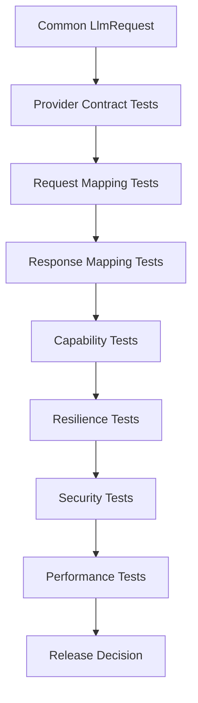

---

## 72.2 Evaluation Categories

| Category | Purpose |
|---|---|
| Contract | Verify common provider behavior |
| Mapping | Verify request and response transformation |
| Capability | Verify supported and unsupported features |
| Reliability | Verify retry, fallback, and circuit breaker |
| Security | Verify data and credential policies |
| Performance | Measure latency and throughput |
| Compatibility | Compare providers and models |
| Regression | Detect framework behavior changes |

---

# 73. Provider Contract Tests

Every `LlmProvider` implementation must pass the same contract test suite.

The contract suite should verify:

- Provider type is returned
- Provider name is present
- Availability can be checked
- Capabilities are declared
- Valid requests produce normalized responses
- Invalid requests fail predictably
- Tool Calls are normalized
- Finish reasons are normalized
- Usage values are not negative
- Timeouts are enforced
- Credentials are not exposed
- Provider SDK types do not escape

---

## 73.1 Abstract Provider Contract Test

```java
package kr.co.goms.gomsbook.ai.llm.provider.contract;

import static org.junit.jupiter.api.Assertions.assertEquals;
import static org.junit.jupiter.api.Assertions.assertFalse;
import static org.junit.jupiter.api.Assertions.assertNotNull;

import org.junit.jupiter.api.Test;

import kr.co.goms.gomsbook.ai.llm.model.LlmRequest;
import kr.co.goms.gomsbook.ai.llm.model.LlmResponse;
import kr.co.goms.gomsbook.ai.llm.provider.LlmProvider;

public abstract class LlmProviderContractTest {

    protected abstract LlmProvider createProvider();

    protected abstract LlmRequest createValidRequest();

    @Test
    void shouldReturnProviderType() {
        LlmProvider provider = createProvider();

        assertNotNull(provider.getType());
    }

    @Test
    void shouldReturnProviderName() {
        LlmProvider provider = createProvider();

        assertNotNull(provider.getName());
        assertFalse(provider.getName().isBlank());
    }

    @Test
    void shouldExposeCapabilities() {
        LlmProvider provider = createProvider();

        assertNotNull(provider.getCapabilities());
    }

    @Test
    void shouldReturnNormalizedResponse() {
        LlmProvider provider = createProvider();
        LlmRequest request = createValidRequest();

        LlmResponse response = provider.generate(request);

        assertNotNull(response);
        assertEquals(request.requestId(), response.requestId());
        assertEquals(provider.getType(), response.provider());
        assertNotNull(response.finishReason());
        assertNotNull(response.messages());
        assertNotNull(response.toolCalls());
    }
}
```

Each provider-specific test class extends this contract.

```java
class OpenAiProviderContractTest
        extends LlmProviderContractTest {
}
```

```java
class OllamaProviderContractTest
        extends LlmProviderContractTest {
}
```

---

# 74. Mock Provider

A deterministic Mock Provider is required for unit tests, offline development, and prompt regression testing.

```java
package kr.co.goms.gomsbook.ai.llm.provider.mock;

import java.time.Duration;
import java.util.List;
import java.util.Map;
import java.util.function.Function;

import kr.co.goms.gomsbook.ai.llm.model.LlmFinishReason;
import kr.co.goms.gomsbook.ai.llm.model.LlmMessage;
import kr.co.goms.gomsbook.ai.llm.model.LlmRequest;
import kr.co.goms.gomsbook.ai.llm.model.LlmResponse;
import kr.co.goms.gomsbook.ai.llm.model.LlmRole;
import kr.co.goms.gomsbook.ai.llm.model.LlmUsage;
import kr.co.goms.gomsbook.ai.llm.provider.LlmProvider;
import kr.co.goms.gomsbook.ai.llm.provider.LlmProviderType;
import kr.co.goms.gomsbook.ai.llm.provider.ProviderCapabilities;

public final class MockLlmProvider
        implements LlmProvider {

    private final Function<LlmRequest, LlmResponse> responder;

    public MockLlmProvider(
            Function<LlmRequest, LlmResponse> responder
    ) {
        this.responder = responder;
    }

    @Override
    public LlmProviderType getType() {
        return LlmProviderType.MOCK;
    }

    @Override
    public String getName() {
        return "Mock LLM Provider";
    }

    @Override
    public boolean isAvailable() {
        return true;
    }

    @Override
    public ProviderCapabilities getCapabilities() {
        return new ProviderCapabilities(
                true,
                true,
                true,
                true,
                true,
                true,
                true,
                true,
                true
        );
    }

    @Override
    public LlmResponse generate(LlmRequest request) {
        if (responder != null) {
            return responder.apply(request);
        }

        return new LlmResponse(
                request.requestId(),
                "mock-response-001",
                LlmProviderType.MOCK,
                "mock-model",
                List.of(
                        LlmMessage.text(
                                LlmRole.ASSISTANT,
                                "{\"status\":\"SUCCESS\"}"
                        )
                ),
                List.of(),
                LlmUsage.unknown(),
                LlmFinishReason.STOP,
                Duration.ZERO,
                Map.of()
        );
    }
}
```

---

## 74.1 Mock Provider Modes

Recommended modes:

```text
SUCCESS
TIMEOUT
RATE_LIMIT
MALFORMED_RESPONSE
TOOL_CALL
STREAM_INTERRUPTED
CONTENT_FILTERED
MODEL_UNAVAILABLE
```

These modes allow deterministic resilience tests.

---

# 75. Request Mapper Testing

Provider request mappers should be tested without real network calls.

Tests should verify:

- Model mapping
- Message role mapping
- Text content mapping
- Image content mapping
- Tool definition mapping
- Tool result mapping
- Response format mapping
- Generation option mapping
- Timeout mapping
- Metadata exclusion
- Unsupported capability rejection

---

## 75.1 Request Mapper Example

```java
package kr.co.goms.gomsbook.ai.llm.provider.openai;

import static org.junit.jupiter.api.Assertions.assertEquals;

import org.junit.jupiter.api.Test;

class OpenAiRequestMapperTest {

    private final OpenAiRequestMapper mapper =
            new OpenAiRequestMapper();

    @Test
    void shouldMapModelName() {
        var request = LlmTestFixtures.basicRequest(
                "gpt-test-model"
        );

        OpenAiRequest mapped = mapper.map(request);

        assertEquals(
                "gpt-test-model",
                mapped.model()
        );
    }
}
```

---

# 76. Response Mapper Testing

Response mapper tests should verify:

- Text normalization
- Multiple message handling
- Tool Call extraction
- Usage normalization
- Finish reason normalization
- Original provider finish reason preservation
- Response ID mapping
- Model name mapping
- Safety block mapping
- Missing usage handling

---

## 76.1 Finish Reason Test

```java
@Test
void shouldNormalizeToolCallFinishReason() {
    var providerResponse =
            OpenAiTestFixtures.toolCallResponse();

    LlmResponse response = mapper.map(
            originalRequest,
            providerResponse
    );

    assertEquals(
            LlmFinishReason.TOOL_CALL,
            response.finishReason()
    );
}
```

---

# 77. Integration Testing

Integration tests verify complete provider execution flows.

```text
LlmRequest
      │
      ▼
LlmClient
      │
      ▼
ProviderSelector
      │
      ▼
LlmProvider
      │
      ▼
Mock HTTP Server
      │
      ▼
LlmResponse
```

---

## 77.1 Integration Scenarios

Recommended scenarios:

- Successful text generation
- Successful structured JSON response
- Successful Tool Call
- Invalid API key
- Provider rate limit
- Provider timeout
- Model not found
- Context limit exceeded
- Content filter response
- Local provider unavailable
- Streaming completion
- Streaming cancellation
- Retry success
- Retry exhaustion
- Provider fallback success
- Circuit breaker open
- Sensitive-content cloud block

---

## 77.2 Mock HTTP Server

Provider API integration tests should use a local mock server.

The mock server should support:

- Configurable status codes
- Configurable response bodies
- Delayed responses
- Streaming chunks
- Connection interruption
- Rate-limit headers
- Provider-specific error formats

Real API calls should not be required for the standard test suite.

---

# 78. Performance Testing

Performance tests should measure framework overhead separately from provider latency.

Metrics include:

- Request mapping time
- Response mapping time
- Provider selection time
- Security evaluation time
- Token estimation time
- Streaming event throughput
- Concurrent request throughput
- Memory usage
- Cancellation latency
- Local provider startup latency

---

## 78.1 Performance Targets

Initial framework targets:

| Metric | Target |
|---|---:|
| Request mapping | Below 10 ms |
| Response mapping | Below 20 ms |
| Provider selection | Below 5 ms |
| Security evaluation | Below 10 ms |
| Cancellation propagation | Below 500 ms |
| Added framework overhead | Below 50 ms |

These targets exclude external provider inference time.

---

# 79. Security Testing

Security tests must verify:

- API keys are never logged
- Authorization headers are masked
- Credential references are resolved securely
- Credentials do not appear in exceptions
- Full manuscript text is not logged
- Local-only projects cannot use cloud providers
- Sensitive content requires confirmation
- Unknown providers are blocked
- Cloud fallback respects project policy
- Tool arguments are not executed by the LLM layer
- Path or file references do not bypass Tool security
- Provider metadata is sanitized

---

## 79.1 Credential Leakage Test

```java
@Test
void shouldNotExposeCredentialInException() {
    String secret = "test-secret-key";

    Exception exception = executeFailingRequest(secret);

    assertFalse(
            exception.getMessage().contains(secret)
    );
}
```

---

## 79.2 Local-Only Policy Test

```java
@Test
void shouldBlockCloudProviderForLocalOnlyProject() {
    LlmSecurityRequest request =
            new LlmSecurityRequest(
                    LlmProviderType.OPENAI,
                    false,
                    Set.of("UNPUBLISHED_MANUSCRIPT"),
                    true,
                    false,
                    false
            );

    LlmSecurityDecision decision =
            securityPolicy.evaluate(request);

    assertFalse(decision.allowed());
}
```

---

# 80. Streaming Testing

Streaming tests should verify:

- Start event is emitted first
- Text deltas preserve order
- Tool Call arguments are assembled correctly
- Usage update is optional
- Completed event is emitted once
- Failed event terminates the stream
- Cancellation closes the stream
- Partial output is never marked complete
- Validation runs only after completion
- Backpressure is respected

---

## 80.1 Streaming Event Sequence

Expected sequence:

```text
LlmStreamStarted
LlmTextDelta
LlmTextDelta
LlmUsageUpdate
LlmStreamCompleted
```

Error sequence:

```text
LlmStreamStarted
LlmTextDelta
LlmStreamFailed
```

No event should be emitted after completion or failure.

---

# 81. Compatibility Matrix

The framework should maintain a tested compatibility matrix.

| Feature | OpenAI | Gemini | Claude | Ollama | LM Studio |
|---|---:|---:|---:|---:|---:|
| Text generation | Required | Required | Required | Required | Required |
| Streaming | Required | Required | Required | Required | Required |
| JSON output | Required | Required | Required | Model-dependent | Model-dependent |
| JSON Schema | Provider-specific | Provider-specific | Provider-specific | Model-dependent | Model-dependent |
| Tool Calling | Provider-specific | Provider-specific | Provider-specific | Model-dependent | Model-dependent |
| Vision | Model-dependent | Model-dependent | Model-dependent | Model-dependent | Model-dependent |
| Embeddings | Provider-specific | Provider-specific | Provider-specific | Supported | Model-dependent |
| Local execution | No | No | No | Yes | Yes |

Capabilities must be detected or configured at runtime rather than inferred only from provider name.

---

# 82. Final LLM Architecture

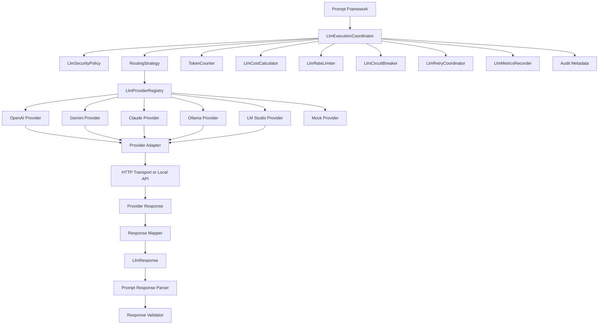

---

# 83. Final LLM Class Diagram

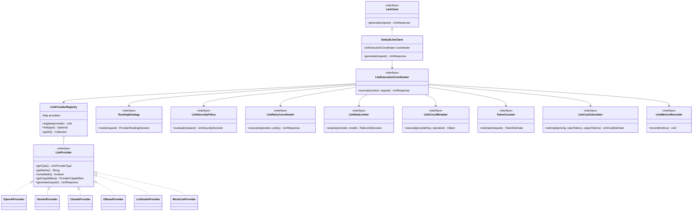

---

# 84. Final Package Structure

```text
src/main/java/kr/co/goms/gomsbook/ai/llm/
├── client/
│   ├── LlmClient.java
│   ├── DefaultLlmClient.java
│   └── StreamingLlmClient.java
│
├── config/
│   ├── ModelConfiguration.java
│   ├── ProviderConfiguration.java
│   └── ProviderConfigurationRepository.java
│
├── cost/
│   ├── LlmCostCalculator.java
│   ├── LlmCostEstimate.java
│   ├── LlmCostPolicy.java
│   └── ModelPricing.java
│
├── error/
│   ├── LlmConfigurationException.java
│   ├── LlmErrorType.java
│   ├── LlmException.java
│   ├── LlmProviderException.java
│   ├── LlmProviderNotFoundException.java
│   └── LlmProviderUnavailableException.java
│
├── evaluation/
│   ├── LlmEvaluationCase.java
│   ├── LlmEvaluationResult.java
│   └── LlmEvaluationRunner.java
│
├── execution/
│   ├── CancellationToken.java
│   ├── DefaultLlmExecutionCoordinator.java
│   ├── LlmExecutionContext.java
│   └── LlmExecutionCoordinator.java
│
├── model/
│   ├── LlmContentPart.java
│   ├── LlmFinishReason.java
│   ├── LlmGenerationOptions.java
│   ├── LlmImageContent.java
│   ├── LlmImageDetail.java
│   ├── LlmMessage.java
│   ├── LlmRequest.java
│   ├── LlmResponse.java
│   ├── LlmResponseFormat.java
│   ├── LlmResponseFormatType.java
│   ├── LlmRole.java
│   ├── LlmTextContent.java
│   ├── LlmToolResultContent.java
│   ├── LlmUsage.java
│   │
│   └── discovery/
│       ├── AvailableModel.java
│       ├── ModelCapability.java
│       └── ModelDiscoveryService.java
│
├── monitoring/
│   ├── LlmExecutionMetrics.java
│   └── LlmMetricsRecorder.java
│
├── provider/
│   ├── LlmProvider.java
│   ├── LlmProviderRegistry.java
│   ├── LlmProviderType.java
│   ├── ProviderCapabilities.java
│   ├── ProviderHealth.java
│   ├── ProviderHealthIndicator.java
│   ├── ProviderHealthStatus.java
│   │
│   ├── adapter/
│   │   ├── ProviderAdapter.java
│   │   ├── ProviderRequestMapper.java
│   │   └── ProviderResponseMapper.java
│   │
│   ├── capability/
│   │   ├── CapabilityValidationResult.java
│   │   └── ProviderCapabilityValidator.java
│   │
│   ├── error/
│   │   └── ProviderErrorMapper.java
│   │
│   ├── mock/
│   │   └── MockLlmProvider.java
│   │
│   ├── openai/
│   ├── gemini/
│   ├── claude/
│   ├── ollama/
│   └── lmstudio/
│
├── rate/
│   ├── LlmRateLimiter.java
│   ├── RateLimitDecision.java
│   └── RateLimitPolicy.java
│
├── resilience/
│   ├── CircuitBreakerPolicy.java
│   ├── CircuitState.java
│   └── LlmCircuitBreaker.java
│
├── retry/
│   ├── LlmRetryCoordinator.java
│   └── LlmRetryPolicy.java
│
├── routing/
│   ├── ConfiguredProviderSelector.java
│   ├── FallbackPolicy.java
│   ├── LocalFirstPolicy.java
│   ├── ProviderRoutingDecision.java
│   ├── ProviderRoutingRequest.java
│   ├── ProviderSelector.java
│   └── RoutingStrategy.java
│
├── security/
│   ├── CompositeCredentialProvider.java
│   ├── Credential.java
│   ├── CredentialProvider.java
│   ├── LlmSecurityDecision.java
│   ├── LlmSecurityPolicy.java
│   ├── LlmSecurityRequest.java
│   └── SecureStorageCredentialProvider.java
│
├── streaming/
│   ├── LlmStreamCompleted.java
│   ├── LlmStreamEvent.java
│   ├── LlmStreamFailed.java
│   ├── LlmStreamStarted.java
│   ├── LlmTextDelta.java
│   ├── LlmToolCallDelta.java
│   └── LlmUsageUpdate.java
│
├── token/
│   ├── ContextLimitValidationResult.java
│   ├── ContextLimitValidator.java
│   ├── TokenCounter.java
│   └── TokenEstimate.java
│
├── tool/
│   ├── LlmToolCall.java
│   └── LlmToolDefinition.java
│
└── transport/
    ├── HttpRequest.java
    ├── HttpResponse.java
    ├── HttpTransport.java
    └── JavaHttpClientTransport.java
```

Test structure:

```text
src/test/
├── java/kr/co/goms/gomsbook/ai/llm/
│   ├── client/
│   ├── execution/
│   ├── provider/
│   │   ├── contract/
│   │   ├── openai/
│   │   ├── gemini/
│   │   ├── claude/
│   │   ├── ollama/
│   │   └── lmstudio/
│   ├── resilience/
│   ├── routing/
│   ├── security/
│   ├── streaming/
│   └── token/
│
└── resources/
    ├── provider-responses/
    ├── streaming/
    └── configuration/
```

---

# 85. Implementation Priority

The framework should be implemented incrementally.

## Phase 1 — Core Models

- [ ] `LlmRequest`
- [ ] `LlmResponse`
- [ ] `LlmMessage`
- [ ] `LlmContentPart`
- [ ] `LlmUsage`
- [ ] `LlmFinishReason`
- [ ] `ModelConfiguration`

## Phase 2 — Provider Framework

- [ ] `LlmProvider`
- [ ] `LlmProviderRegistry`
- [ ] `ProviderSelector`
- [ ] `ProviderCapabilities`
- [ ] `MockLlmProvider`

## Phase 3 — First Provider

Recommended first provider:

```text
Ollama
```

Reasons:

- Local execution
- No cloud API cost
- Suitable for private manuscript testing
- Easy health check
- Suitable for initial integration

Implementation items:

- [ ] `OllamaConfiguration`
- [ ] `OllamaProvider`
- [ ] `OllamaRequestMapper`
- [ ] `OllamaResponseMapper`
- [ ] `OllamaHealthService`
- [ ] `OllamaModelService`

## Phase 4 — Prompt Integration

- [ ] Convert `PromptRequest` to `LlmRequest`
- [ ] Execute through `LlmClient`
- [ ] Parse structured output
- [ ] Validate response
- [ ] Record metadata

## Phase 5 — Reliability

- [ ] Retry policy
- [ ] Provider fallback
- [ ] Rate limiter
- [ ] Circuit breaker
- [ ] Cancellation
- [ ] Streaming

## Phase 6 — Cloud Providers

- [ ] OpenAI
- [ ] Gemini
- [ ] Claude
- [ ] Secure credentials
- [ ] Cost monitoring
- [ ] Cloud-transmission confirmation

## Phase 7 — Evaluation

- [ ] Provider contract suite
- [ ] Compatibility matrix
- [ ] Performance tests
- [ ] Security tests
- [ ] Regression tests

---

## 85.1 First Working Vertical Slice

The first complete workflow should be:

```text
GomsBookEditor Request
      │
      ▼
PromptBuilder
      │
      ▼
PromptRequest
      │
      ▼
LlmRequest Mapper
      │
      ▼
DefaultLlmClient
      │
      ▼
OllamaProvider
      │
      ▼
Local Model
      │
      ▼
LlmResponse
      │
      ▼
StructuredResponseParser
      │
      ▼
ResponseValidator
      │
      ▼
GomsBookEditor Preview
```

This proves:

- Prompt and LLM separation
- Provider abstraction
- Local model integration
- Request and response normalization
- Structured output parsing
- Validation
- Editor integration

---

# 86. Definition of Done

An LLM provider implementation is complete only when:

- It implements `LlmProvider`
- Configuration validation is implemented
- Health check is implemented
- Request mapping tests pass
- Response mapping tests pass
- Provider contract tests pass
- Tool Call mapping is tested
- Structured output behavior is documented
- Streaming behavior is tested
- Timeout and cancellation are tested
- Security tests pass
- Credentials are protected
- Usage reporting behavior is documented
- Error mapping is complete
- Retry classification is defined
- Compatibility matrix is updated

The entire LLM Framework is complete only when:

- At least one local provider works
- At least one cloud provider works
- Provider selection is policy-driven
- Local-only mode is enforced
- Retry and fallback are tested
- Streaming and cancellation work
- Metrics and audit metadata are recorded
- Prompt Framework integration works
- Tool Calls are returned but not executed by the LLM layer
- Regression tests run automatically

---

# 87. Document History

| Version | Date | Description |
|---|---|---|
| 1.0.0 | 2026-08-03 | Initial provider-neutral LLM Framework design |
| 1.1.0 | TBD | Ollama integration |
| 1.2.0 | TBD | Cloud provider adapters |
| 1.3.0 | TBD | Streaming and resilience |
| 2.0.0 | TBD | Multi-Agent model routing |

---

# 88. Final Summary

The GomsBook AI Agent LLM Framework provides a provider-independent execution layer between the Prompt Framework and cloud or local AI models.

The framework separates:

- Common request and response models
- Provider selection
- Provider-specific request mapping
- Provider-specific response mapping
- Secure credential management
- Tool Calling normalization
- Structured output support
- Streaming
- Retry and fallback
- Rate limiting
- Circuit breaking
- Token and cost management
- Security policy
- Metrics and evaluation

The central architectural rules are:

- Application logic depends on `LlmClient`, not provider SDKs
- Provider-specific types remain inside provider packages
- Tool Calls are normalized but never executed by the LLM layer
- Local-first execution is available for sensitive manuscripts
- Cloud transmission is controlled by explicit security policy
- Retry and fallback preserve capability and security requirements
- Streaming output remains provisional until completion
- Credentials and manuscript content must not appear in logs
- Every provider must pass the same contract test suite
- New providers can be added without changing Prompt, Tool, EPUB, or Editor logic

This design allows GomsBook AI Agent to evolve from a local EPUB assistant into a reliable multi-provider AI publishing platform.