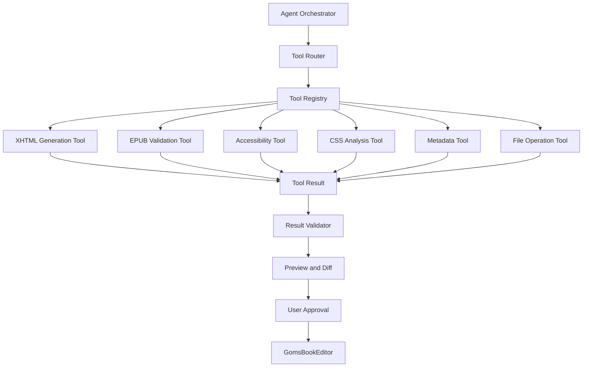

# GomsBook AI Agent Tool Design

> Design specification for the tools used by GomsBook AI Agent.

---

## Overview

GomsBook AI Agent uses a tool-based architecture.

The LLM does not directly modify EPUB project files. Instead, the Agent analyzes the user request, selects an appropriate tool, executes the tool, validates the result, and presents the proposed changes to the user.

This design improves reliability, testability, security, and maintainability.

---

## Design Goals

The tool layer follows these principles.

- Clear responsibility
- Structured input and output
- Validation before file modification
- Human approval before destructive changes
- LLM provider independence
- Reusable domain logic
- Easy unit testing
- Extensible tool registry
- Traceable execution history

---

## Tool Execution Flow

```text
User Request
      │
      ▼
Intent Analysis
      │
      ▼
Task Planner
      │
      ▼
Tool Router
      │
      ▼
Tool Input Validation
      │
      ▼
Tool Execution
      │
      ▼
Result Validation
      │
      ▼
Preview / Diff
      │
      ▼
User Approval
      │
      ▼
Apply to GomsBookEditor
```

---

## Tool Architecture



---

# Core Interfaces

## AgentTool

Every tool implements a common interface.

```java
package kr.co.goms.gomsbook.ai.tool;

public interface AgentTool<I, O> {

    String getName();

    String getDescription();

    Class<I> getInputType();

    ToolValidationResult validateInput(I input);

    ToolResult<O> execute(ToolContext context, I input);
}
```

### Responsibilities

- Declare the tool name
- Explain the tool purpose
- Define the input type
- Validate input values
- Execute domain-specific logic
- Return a structured result

---

## ToolContext

`ToolContext` contains execution information shared by tools.

```java
package kr.co.gomsbook.ai.tool;

import java.nio.file.Path;
import java.util.Map;

public record ToolContext(
        String projectId,
        Path projectRoot,
        String userId,
        String requestId,
        Map<String, Object> attributes
) {
}
```

### Possible Context Values

- Current EPUB project path
- Current XHTML file
- Book metadata
- Selected text
- Editor state
- User preferences
- LLM provider
- Execution request ID

---

## ToolResult

Every tool returns a standardized result.

```java
package kr.co.gomsbook.ai.tool;

import java.util.List;

public record ToolResult<T>(
        ToolStatus status,
        T data,
        String message,
        List<ToolIssue> issues,
        ToolExecutionMetadata metadata
) {

    public boolean isSuccess() {
        return status == ToolStatus.SUCCESS;
    }
}
```

---

## ToolStatus

```java
package kr.co.gomsbook.ai.tool;

public enum ToolStatus {
    SUCCESS,
    VALIDATION_FAILED,
    EXECUTION_FAILED,
    APPROVAL_REQUIRED,
    CANCELLED
}
```

---

## ToolIssue

```java
package kr.co.gomsbook.ai.tool;

public record ToolIssue(
        String code,
        ToolIssueSeverity severity,
        String message,
        String location,
        String suggestion
) {
}
```

```java
package kr.co.gomsbook.ai.tool;

public enum ToolIssueSeverity {
    INFO,
    WARNING,
    ERROR,
    CRITICAL
}
```

---

## ToolValidationResult

```java
package kr.co.gomsbook.ai.tool;

import java.util.List;

public record ToolValidationResult(
        boolean valid,
        List<ToolIssue> issues
) {

    public static ToolValidationResult success() {
        return new ToolValidationResult(true, List.of());
    }
}
```

---

# Tool Registry

The Tool Registry manages all available tools.

```java
package kr.co.gomsbook.ai.tool;

import java.util.Collection;
import java.util.HashMap;
import java.util.Map;
import java.util.Optional;

public class ToolRegistry {

    private final Map<String, AgentTool<?, ?>> tools = new HashMap<>();

    public void register(AgentTool<?, ?> tool) {
        tools.put(tool.getName(), tool);
    }

    public Optional<AgentTool<?, ?>> findByName(String name) {
        return Optional.ofNullable(tools.get(name));
    }

    public Collection<AgentTool<?, ?>> getAll() {
        return tools.values();
    }
}
```

### Example Registration

```java
ToolRegistry registry = new ToolRegistry();

registry.register(new XhtmlGenerationTool());
registry.register(new EpubValidationTool());
registry.register(new AccessibilityCheckTool());
registry.register(new CssAnalysisTool());
registry.register(new MetadataGenerationTool());
```

---

# Tool Router

The Tool Router selects a tool based on the Agent plan.

```java
package kr.co.gomsbook.ai.tool;

public interface ToolRouter {

    ToolSelection selectTool(
            AgentTask task,
            ToolRegistry registry
    );
}
```

### Tool Selection Example

| Intent | Tool |
|---|---|
| `generate_xhtml` | `xhtml.generate` |
| `validate_epub` | `epub.validate` |
| `check_accessibility` | `accessibility.check` |
| `analyze_css` | `css.analyze` |
| `generate_metadata` | `metadata.generate` |
| `apply_file_change` | `file.apply-change` |

---

# Tool Definitions

## 1. XHTML Generation Tool

### Tool Name

```text
xhtml.generate
```

### Purpose

Generate EPUB3-compatible XHTML according to GomsBookEditor project rules.

### Input

```java
package kr.co.gomsbook.ai.tool.xhtml;

import java.util.List;

public record XhtmlGenerationInput(
        String chapterTitle,
        String sourceText,
        String language,
        String headingLevel,
        String paragraphIdPrefix,
        boolean accessibilityEnabled,
        List<String> formattingRules
) {
}
```

### Example Input

```json
{
  "chapterTitle": "꽃은 자신을 재촉하지 않는다",
  "sourceText": "봄이 오면 꽃은 자신의 때를 따라 핀다.",
  "language": "ko",
  "headingLevel": "h1",
  "paragraphIdPrefix": "p_",
  "accessibilityEnabled": true,
  "formattingRules": [
    "one sentence per paragraph",
    "two-digit paragraph IDs",
    "include aria-labelledby"
  ]
}
```

### Output

```java
package kr.co.gomsbook.ai.tool.xhtml;

import java.util.List;

public record XhtmlGenerationOutput(
        String fileName,
        String xhtml,
        List<String> generatedParagraphIds,
        List<String> appliedRules
) {
}
```

### Processing Flow

```text
Source Text
    │
    ▼
Content Structure Analysis
    │
    ▼
Heading and Paragraph Generation
    │
    ▼
Accessibility Attribute Injection
    │
    ▼
XHTML Serialization
    │
    ▼
Syntax Validation
```

### Validation Rules

- XHTML5 document structure
- UTF-8 encoding
- EPUB namespace
- Valid `lang` and `xml:lang`
- Unique element IDs
- Correct heading hierarchy
- Valid `aria-labelledby`
- Escaped XML characters
- Closed tags
- Valid image paths

---

## 2. EPUB Validation Tool

### Tool Name

```text
epub.validate
```

### Purpose

Validate EPUB package structure and content.

### Input

```java
package kr.co.gomsbook.ai.tool.epub;

import java.nio.file.Path;

public record EpubValidationInput(
        Path epubPath,
        boolean runEpubCheck,
        boolean validateInternalRules,
        boolean validateAccessibility
) {
}
```

### Output

```java
package kr.co.gomsbook.ai.tool.epub;

import java.util.List;

public record EpubValidationOutput(
        boolean valid,
        int errorCount,
        int warningCount,
        List<ToolIssue> issues,
        String report
) {
}
```

### Validation Scope

- MIME type
- ZIP structure
- `META-INF/container.xml`
- Package document
- Manifest
- Spine
- Navigation document
- Resource paths
- Duplicate IDs
- Broken links
- Missing images
- Invalid media types
- XHTML syntax
- EPUBCheck result

---

## 3. Accessibility Check Tool

### Tool Name

```text
accessibility.check
```

### Purpose

Inspect XHTML and EPUB metadata for accessibility issues.

### Input

```java
package kr.co.gomsbook.ai.tool.accessibility;

import java.nio.file.Path;

public record AccessibilityCheckInput(
        Path targetPath,
        boolean checkMetadata,
        boolean checkNavigation,
        boolean checkImages,
        boolean checkHeadingStructure
) {
}
```

### Output

```java
package kr.co.gomsbook.ai.tool.accessibility;

import java.util.List;

public record AccessibilityCheckOutput(
        int score,
        List<ToolIssue> issues,
        List<String> passedChecks,
        List<String> recommendedActions
) {
}
```

### Checks

- Document language
- Heading hierarchy
- Image alternative text
- Decorative image treatment
- Navigation structure
- Landmark roles
- ARIA references
- Table headers
- Link text quality
- Accessibility metadata
- Page navigation
- Reading order

---

## 4. CSS Analysis Tool

### Tool Name

```text
css.analyze
```

### Purpose

Detect CSS compatibility and layout issues in EPUB preview and PDF export.

### Input

```java
package kr.co.gomsbook.ai.tool.css;

import java.nio.file.Path;
import java.util.List;

public record CssAnalysisInput(
        Path cssFile,
        List<Path> xhtmlFiles,
        String targetRenderer,
        boolean checkUnsupportedProperties
) {
}
```

### Output

```java
package kr.co.gomsbook.ai.tool.css;

import java.util.List;

public record CssAnalysisOutput(
        List<ToolIssue> issues,
        List<CssSuggestion> suggestions,
        String normalizedCss
) {
}
```

### Analysis Scope

- Unsupported CSS properties
- Page overflow
- Fixed width problems
- Table clipping
- Missing background images
- Incorrect relative paths
- Unsupported font formats
- Invalid `@page` rules
- Excessive margins and padding
- OpenHTMLtoPDF compatibility

---

## 5. Metadata Generation Tool

### Tool Name

```text
metadata.generate
```

### Purpose

Generate publishing metadata from book information.

### Input

```java
package kr.co.gomsbook.ai.tool.metadata;

import java.util.List;

public record MetadataGenerationInput(
        String title,
        String subtitle,
        String author,
        String publisher,
        String language,
        String descriptionSource,
        List<String> categories
) {
}
```

### Output

```java
package kr.co.gomsbook.ai.tool.metadata;

import java.util.List;
import java.util.Map;

public record MetadataGenerationOutput(
        String description,
        List<String> keywords,
        Map<String, String> opfMetadata,
        String authorIntroduction
) {
}
```

### Generated Fields

- Title
- Subtitle
- Creator
- Publisher
- Language
- Description
- Keywords
- Subject
- Modified date
- Accessibility metadata
- Distribution description

---

## 6. File Change Tool

### Tool Name

```text
file.apply-change
```

### Purpose

Apply an approved change to a GomsBookEditor project file.

This tool must not be executed before user approval when replacing or deleting existing content.

### Input

```java
package kr.co.gomsbook.ai.tool.file;

import java.nio.file.Path;

public record FileChangeInput(
        Path targetFile,
        String originalContent,
        String proposedContent,
        FileChangeType changeType,
        boolean userApproved
) {
}
```

```java
package kr.co.gomsbook.ai.tool.file;

public enum FileChangeType {
    CREATE,
    UPDATE,
    DELETE,
    RENAME
}
```

### Safety Rules

- Verify the target path is inside the project directory
- Prevent path traversal
- Compare the current file with the expected original content
- Create a backup before replacement
- Require approval for destructive changes
- Write using UTF-8
- Record audit information
- Support rollback

---

# Human-in-the-Loop Design

The Agent should separate generation from modification.

```text
Generate Proposal
      │
      ▼
Validate Proposal
      │
      ▼
Create Diff
      │
      ▼
Show Preview
      │
      ▼
User Approval
      │
      ▼
Apply Change
```

### Approval Required

Approval is required for:

- Replacing an existing XHTML file
- Deleting files
- Renaming files
- Updating OPF metadata
- Changing navigation structure
- Modifying multiple project files
- Packaging and overwriting an EPUB

---

# Diff Model

```java
package kr.co.gomsbook.ai.tool.file;

import java.util.List;

public record FileDiff(
        String targetPath,
        List<DiffLine> lines,
        int addedLines,
        int removedLines
) {
}
```

```java
package kr.co.gomsbook.ai.tool.file;

public record DiffLine(
        DiffType type,
        int oldLineNumber,
        int newLineNumber,
        String content
) {
}
```

```java
package kr.co.gomsbook.ai.tool.file;

public enum DiffType {
    UNCHANGED,
    ADDED,
    REMOVED
}
```

---

# Tool Execution Metadata

Each execution should be traceable.

```java
package kr.co.gomsbook.ai.tool;

import java.time.Duration;
import java.time.Instant;
import java.util.Map;

public record ToolExecutionMetadata(
        String executionId,
        String toolName,
        Instant startedAt,
        Instant completedAt,
        Duration duration,
        int retryCount,
        Map<String, String> attributes
) {
}
```

### Recommended Metadata

- Request ID
- Tool name
- Tool version
- Start and completion time
- LLM provider
- Model name
- Retry count
- Validation result
- User approval status
- Modified file list

Sensitive source content must not be written to logs.

---

# Error Handling

## Error Categories

```java
package kr.co.gomsbook.ai.tool;

public enum ToolErrorCode {
    INVALID_INPUT,
    FILE_NOT_FOUND,
    ACCESS_DENIED,
    PATH_OUTSIDE_PROJECT,
    INVALID_XHTML,
    INVALID_EPUB,
    VALIDATION_FAILED,
    LLM_EXECUTION_FAILED,
    TOOL_EXECUTION_FAILED,
    APPROVAL_REQUIRED,
    CONCURRENT_MODIFICATION
}
```

## Retry Policy

Automatic retry may be used for:

- Temporary LLM failure
- Invalid structured output
- Recoverable formatting errors
- Temporary file lock
- Validation errors that can be corrected safely

Automatic retry must not be used for:

- File deletion
- User cancellation
- Permission failure
- Path traversal detection
- Repeated invalid output
- Destructive operation without approval

---

# Tool Versioning

Each tool should define its version.

```java
public interface VersionedTool {

    String getVersion();
}
```

Example:

```text
xhtml.generate:1.0
epub.validate:1.0
accessibility.check:1.0
css.analyze:1.0
metadata.generate:1.0
```

Versioning helps reproduce evaluation results and manage breaking changes.

---

# Testing Strategy

## Unit Tests

Each tool should be tested independently.

Examples:

- Valid XHTML generation
- Duplicate paragraph ID detection
- Invalid image path detection
- OPF manifest validation
- Missing alt text detection
- Unsupported CSS property detection
- Path traversal rejection

---

## Integration Tests

Integration tests should verify complete workflows.

```text
User Request
    │
    ▼
Planner
    │
    ▼
Tool Router
    │
    ▼
XHTML Generation Tool
    │
    ▼
Accessibility Check Tool
    │
    ▼
File Change Preview
```

---

## Evaluation Dataset

Tool behavior should be evaluated with structured test cases.

```json
{
  "id": "xhtml-001",
  "tool": "xhtml.generate",
  "input": {
    "chapterTitle": "Chapter 1",
    "language": "ko",
    "paragraphIdPrefix": "p_"
  },
  "expected": {
    "contains": [
      "lang=\"ko\"",
      "xml:lang=\"ko\"",
      "aria-labelledby",
      "id=\"p_01\""
    ],
    "validXhtml": true
  }
}
```

---

# Package Structure

```text
src/main/java/com/gomsbook/ai/
├── agent/
│   ├── AgentOrchestrator.java
│   ├── AgentTask.java
│   └── AgentPlan.java
│
├── tool/
│   ├── AgentTool.java
│   ├── ToolContext.java
│   ├── ToolResult.java
│   ├── ToolRegistry.java
│   ├── ToolRouter.java
│   │
│   ├── xhtml/
│   │   ├── XhtmlGenerationTool.java
│   │   ├── XhtmlGenerationInput.java
│   │   └── XhtmlGenerationOutput.java
│   │
│   ├── epub/
│   │   ├── EpubValidationTool.java
│   │   ├── EpubValidationInput.java
│   │   └── EpubValidationOutput.java
│   │
│   ├── accessibility/
│   │   ├── AccessibilityCheckTool.java
│   │   ├── AccessibilityCheckInput.java
│   │   └── AccessibilityCheckOutput.java
│   │
│   ├── css/
│   │   ├── CssAnalysisTool.java
│   │   ├── CssAnalysisInput.java
│   │   └── CssAnalysisOutput.java
│   │
│   ├── metadata/
│   │   ├── MetadataGenerationTool.java
│   │   ├── MetadataGenerationInput.java
│   │   └── MetadataGenerationOutput.java
│   │
│   └── file/
│       ├── FileChangeTool.java
│       ├── FileChangeInput.java
│       └── FileDiff.java
│
├── validation/
├── llm/
├── rag/
└── audit/
```

---

# Initial Implementation Priority

The recommended implementation order is:

1. `AgentTool`
2. `ToolResult`
3. `ToolContext`
4. `ToolRegistry`
5. `ToolRouter`
6. `XhtmlGenerationTool`
7. `AccessibilityCheckTool`
8. `EpubValidationTool`
9. `FileChangeTool`
10. `CssAnalysisTool`
11. `MetadataGenerationTool`

The first working vertical slice should be:

```text
User Request
      │
      ▼
XHTML Generation Tool
      │
      ▼
XHTML Validation
      │
      ▼
Accessibility Check
      │
      ▼
Diff Preview
      │
      ▼
User Approval
      │
      ▼
Save File
```

---

# Future Tools

Planned tools include:

- NAV Generation Tool
- OPF Update Tool
- Image Alternative Text Tool
- Table Accessibility Tool
- EPUB Packaging Tool
- PDF Export Analysis Tool
- Broken Resource Repair Tool
- Translation Tool
- Content Summary Tool
- Publishing Submission Tool

---

# Summary

The GomsBook AI Agent tool layer separates AI reasoning from deterministic publishing operations.

The Agent decides what should be done, while tools perform validated and traceable operations.

This architecture enables GomsBookEditor to support AI-assisted EPUB authoring without allowing uncontrolled LLM output to directly modify project files.